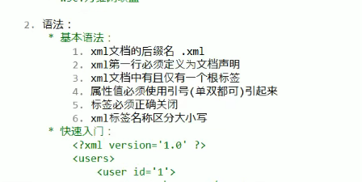
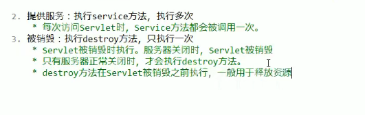
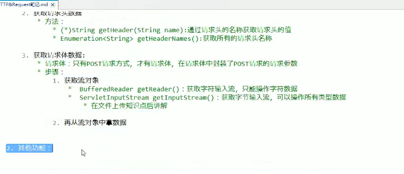
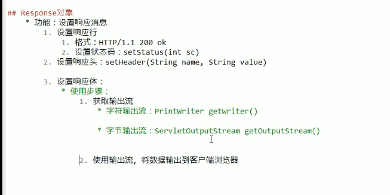
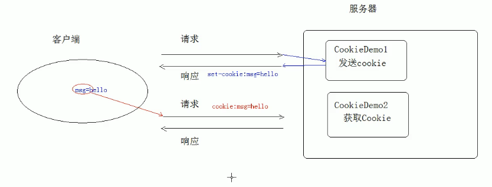
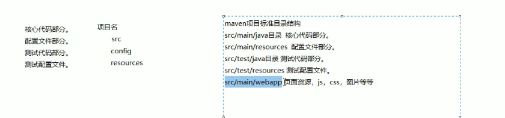

# Javaweb（）

## ##0、跳过了  ->验证码、文件下载、filter的敏感词汇过滤

## ##一、HTML

1. 
2. 
3. 
4. 
5. 
6. 
7. 

## ##二、CSS

1. 
2. 
3. 
4. 
5. 
6. 
7. 

## ##三、JavaScript

1. 
2. 
3. 
4. 
5. 
6. 

### ###1.BOM

1. 
2. 
3. 

### ###DOM

1. 
2. 
3. 
4. 
5. 
6. 
7. 
8. 

### ###BootStrap

1. 
2. 
3. 
4. 

### ###XML

1. 
2. 
3. 
4. 
5. 

## ##一、web

1. 
2. 
3. tomcat软件的结构
4. 
5. 
6. 
7. 

   

### ###Servlet

1. 

2. 

3. 

4. servlet的执行原理

   

5. Servlet的生命周期：

   ```
   1.被创建：执行init方法（一般用于加载资源），只执行一次
   2.提供服务：执行service方法，执行多次
   3.被销毁：执行destroy方法（一般用于释放资源），只执行一次
   ```

   

   

6. https://ip:端口/虚拟路径/资源路径

7. Using CATALINA_BASE:   "C:\Users\xryz\AppData\Local\JetBrains\IntelliJIdea2021.3\tomcat\1de73f68-4d14-4b1c-a276-c91696cdc927"

   

8. Servlet的体系结构

   

### ###HTTP

#### ####HTTP请求消息

1. 

2. 请求信息

   

   

   

3. request的原理

   

4. request的功能

   

   

   其他功能
   
   
   
   
   
   
   
5. JavaBean

   

#### ####HTTP响应消息

1. 

   响应行

   
   
   response的功能
   
2. 重定向的方法（资源跳转的方式，有两次请求）

3. **路径的写法**

4. 服务器输出字节数据到浏览器

5. 服务器输出字节数据到浏览器

### ###ServletContext对象

1. 
2. 

### ###会话技术

1. 会话：一次会话中包含多次请求和响应。
2. **一次会话：浏览器第一次给服务器资源发送请求，会话建立，直到有一方断开为止（即客户端浏览器或服务器关闭）。**
3. 

#### ####Cookie

1. 
2. **实现原理：基于响应头set-cookie和请求头cookie实现**
3. 

4. 
5. 
6. 

### ###JSP

1. 
2. 

### ###Session

1. 
2. 

   

3. 

### ###MVC开发模式

1. 
2. 

### ###Filter

1. 
2. 
3. 

   

   

4. 

5. 

### ###Listener  监听器

1. 
2. 

### ###JQuery

1. 

2. 

   

   

3. 基本选择器

4. DOM操作基础

   

5. DOM高级

   

   

   
   
   

### ###AJAX

1. 

2. 

3. 

   

### ###JSON

1. 

   

2. json数据和java对象的转化

   
   
   
   
3. 案例

### ###Redis

1. 概念：redis是一款高性能的NOSQL系列的非关系型数据库

2. 

   

3. 

### ###Maven

1. Maven项目对象模型(POM)，可以通过一小段描述信息来管理项目的构建，报告和[文档](https://baike.baidu.com/item/文档/1009768)的[项目管理工具](https://baike.baidu.com/item/项目管理工具/6854630)软件。

   Maven 除了以程序构建能力为特色之外，还提供高级项目管理工具。由于 Maven 的缺省构建规则有较高的可重用性，所以常常用两三行 Maven 构建脚本就可以构建简单的项目。由于 Maven 的面向项目的方法，许多 Apache Jakarta 项目发文时使用 Maven，而且公司项目采用 Maven 的比例在持续增长。

   Maven这个单词来自于意第绪语（犹太语），意为知识的积累，最初在Jakata Turbine项目中用来简化构建过程。当时有一些项目（有各自Ant build文件），仅有细微的差别，而JAR文件都由[CVS](https://baike.baidu.com/item/CVS)来维护。于是希望有一种标准化的方式构建项目，一个清晰的方式定义项目的组成，一个容易的方式发布项目的信息，以及一种简单的方式在多个项目中共享JARs。

2. 

3. 仓库的种类和关系

4. maven标准目录结构

5. maven的常用命令和生命周期

6. maven概念模型图

7. 

8. 

9. 

10. 

### ###Nginx

1. 

2. 

   

3. 

   

   

   