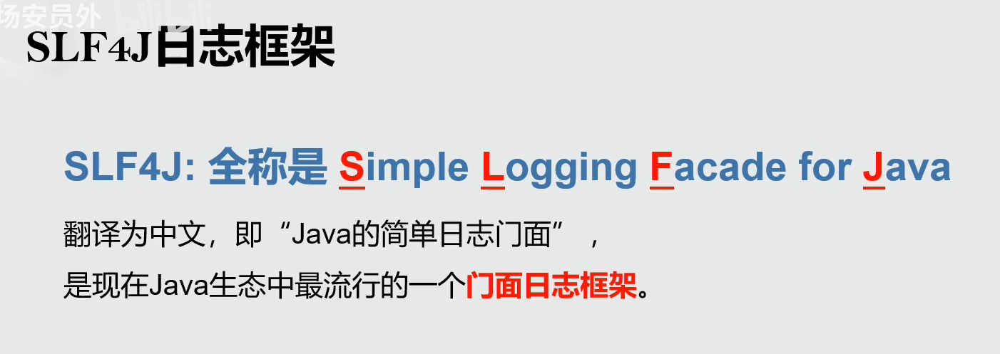
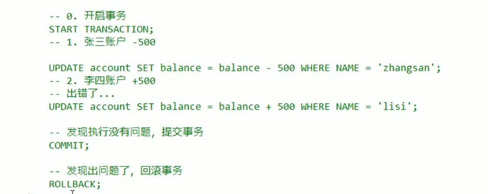
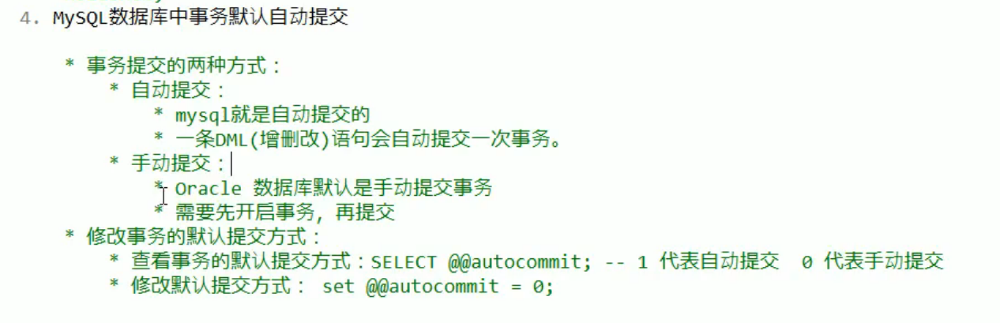
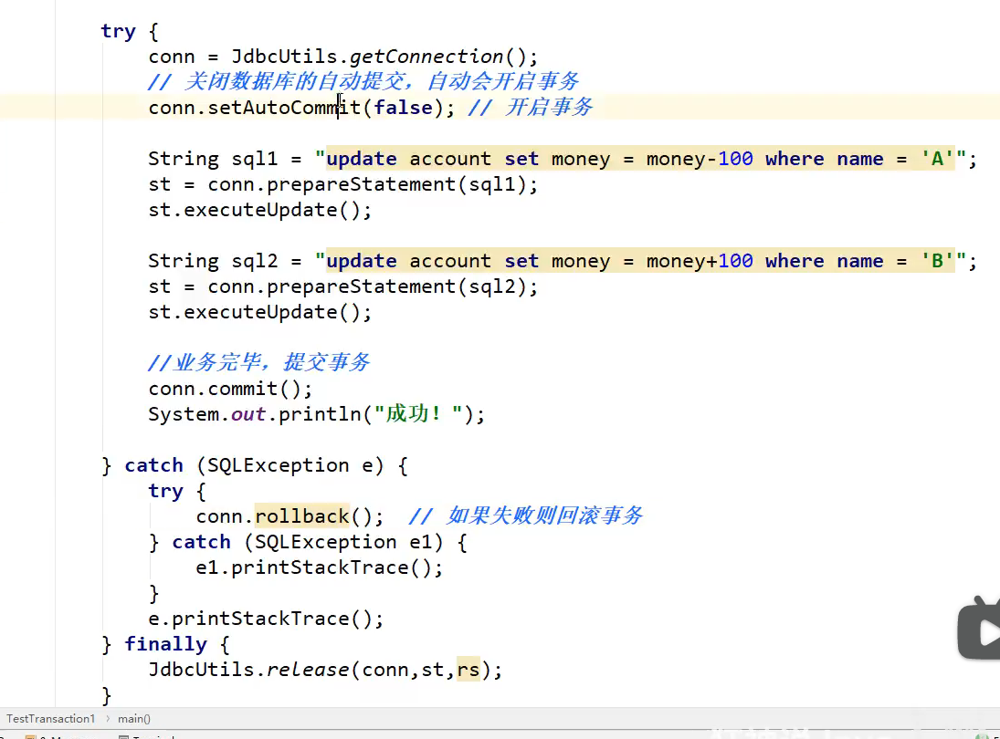
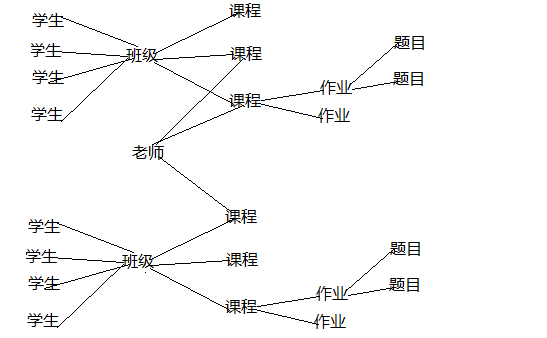
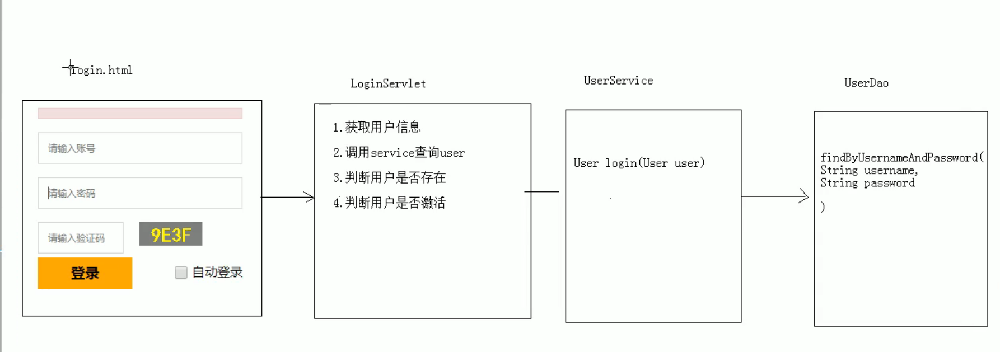
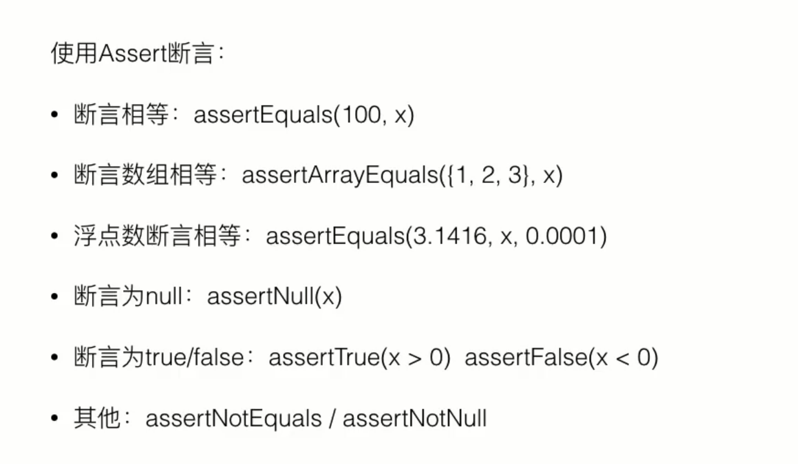

# anyview2

## 一、需了解的技术栈

### 1、单元测试

### 2、MVC模式

### 3、日志记录

1. 

### 4、权限管理（rabc结构）

### 5、postman(接口测试)和设计模式

### 6、（尽量）统一管理数据库连接和连接池并发安全

## 二、注意事项

### 1、Git 提交规范 <type>(<scope>):<subject>

- **type** 包括

- - feat：新功能（feature）
  - fix：修补bug
  - docs：文档（documentation）
  - style： 格式（不影响代码运行的变动）
  - refactor：重构（即不是新增功能，也不是修改bug的代码变动）

- **scope** 指影响范围，具体到包即可
- **subject** 指具体修改内容

- - 举例：`feat(service): 添加账户注册功能`

### 2、特殊注意代码

1. ```
   数据库的时间 与 Java时间的转换
   
   字符串的格式化输出  String.format("%08d",int)
   
    //设置响应体参数
       response.setContentType("application/json;charset=utf-8");
       
       
   jquery-3.3.1.min.js
   
   druid.properties
   driverClassName=com.mysql.jdbc.Driver
   url=jdbc:mysql:///engineering
   username=root
   password=root
   initialSize=5
   maxActive=10
   maxWait=3000
   
   
   driverClassName=com.mysql.jdbc.Driver
url=jdbc:mysql://localhost:3306/druidtest?useUnicode=true&characterEncoding=utf8&useSSL=false
   username=root
password=root
   initialSize=5
maxActive=10
   maxWait=3000
   
   
   
   jackson-annotations-2.2.3.jar
   jackson-core-2.2.3.jar
   jackson-databind-2.2.3.jar
   mysql-connector-java-5.1.47-bin.jar
   druid-1.2.8.jar
   ```
   
   
   
   
   
2. 事务

   

   

   

## 三、建表

## 1、用户表--->用户、角色、权限

1. 用户分为学生、教师、校级管理员、超级管理员
2. 学生 id , student_id, student_name,password,college,grade,class,
3. 老师 id ,job_id , 
4. 

## 2、关系图

1. 

## 九、需要的代码

### 1、BeanHandler

```
package utils;

import utils.IResultSetHandler;

import java.beans.BeanInfo;
import java.beans.Introspector;
import java.beans.PropertyDescriptor;
import java.sql.ResultSet;
import java.sql.SQLException;

public class BeanHandler<T> implements IResultSetHandler<T> {
    private Class<T> clazz;

    public BeanHandler(Class<T> clazz){
        this.clazz = clazz;
    }
    
    @Override
    public T handle(ResultSet rs) throws Exception {
        //结果集默认指向为第一个数据的前一个
        if (rs.next()){
            //根据传入的字节码创建传入的指定对象
            T obj = clazz.newInstance();
            //获取指定字节码信息
            BeanInfo beanInfo = Introspector.getBeanInfo(clazz,Object.class);
            //获取所有属性描述器
            PropertyDescriptor[] pds = beanInfo.getPropertyDescriptors();
            for (PropertyDescriptor pd:pds){
                try {
                    //获取结果集中对应字段名的值
                    Object o = rs.getObject(pd.getName());
                    //执行当前方法并传入参数
                    pd.getWriteMethod().invoke(obj, o);
                }catch (SQLException e){
                    continue;
                }

            }
            return obj;
        }
        return null;

    }
}
```


### 2、BeanListHandler

```
package utils;

import java.beans.BeanInfo;
import java.beans.Introspector;
import java.beans.PropertyDescriptor;
import java.sql.ResultSet;
import java.sql.SQLException;
import java.util.ArrayList;
import java.util.List;

public class BeanListHandler<T>implements IResultSetHandler <List<T>> {
    private Class<T> clazz;

    public BeanListHandler(Class<T> clazz){
        this.clazz = clazz;
    }


    @Override
    public List<T> handle(ResultSet rs) throws Exception {
        //获取指定字节码信息
        BeanInfo beanInfo = Introspector.getBeanInfo(clazz,Object.class);
        //获取所有属性描述器
        PropertyDescriptor[] pds = beanInfo.getPropertyDescriptors();
        List<T> list = new ArrayList<>();
        while (rs.next()){
            T obj = clazz.newInstance();
            for (PropertyDescriptor pd:pds){
               try{
                   //获取结果集中对应字段名的值
                    Object o = rs.getObject(pd.getName());
                    //执行当前方法并传入参数
                    pd.getWriteMethod().invoke(obj,o);
               }catch (SQLException e){
                   continue;
               }

            }
            list.add(obj);
        }
        return list;

    }
}
```


### 3、CRUDUtil

```
package utils;

import java.sql.Connection;
import java.sql.PreparedStatement;
import java.sql.ResultSet;
import java.sql.SQLException;

/**
 * @author LONG
 * 数据库增删查该工具类
 */
public class CRUDUtil {

        /**
         * 增删改操作
         * @param sql 传入的SQL语句
         * @param params 可变参数
         * @return 操作结果
         */
        public static int executeUpdate(String sql,Object... params){
            Connection conn = null;
            PreparedStatement psmt = null;
            int result = 0;
            try {
                //获取数据库连接对象
                conn = JdbcUtil.getConnnection();
                //获取预编译语句对象
                psmt = conn.prepareStatement(sql);
                //给预编译语句赋值
                for (int i = 0; i < params.length; i++) {
                    psmt.setObject(i+1,params[i]);
                }
                //执行SQL语句获取执行结果
                result = psmt.executeUpdate();
            } catch (SQLException e) {
                e.printStackTrace();
            } finally {
                //关闭数据库连接
                JdbcUtil.close(conn,psmt,null);
            }
            return result;
        }

        /**
         * 查询操作
         * @param sql SQL语句
         * @param params 可变参数
         * @return 返回Resultset
         */
        public static  <T> T executeQuery(String sql, IResultSetHandler<T> handler, Object... params){
            Connection conn = null;
            PreparedStatement psmt = null;
            ResultSet rs = null;
            try {
                //获取数据库连接对象
                conn = JdbcUtil.getConnnection();
                //获取预编译语句对象
                psmt = conn.prepareStatement(sql);
                //给预编译语句赋值
                for (int i = 0; i < params.length; i++) {
                    psmt.setObject(i+1,params[i]);
                }
                //执行SQL语句获取结果集
                rs = psmt.executeQuery();
                //处理结果
                return handler.handle(rs);

            } catch (Exception e) {
                e.printStackTrace();
            }finally {
                JdbcUtil.close(conn,psmt,rs);
            }
            return null;
        }

}
```


### 4、接口  IResultSetHandler

```
package utils;

import java.sql.ResultSet;

public interface IResultSetHandler<T> {
    T handle(ResultSet rs) throws Exception;
}
```


### 5、JdbcUtil

```
package utils;

import com.alibaba.druid.pool.DruidDataSourceFactory;

import javax.sql.DataSource;
import java.sql.Connection;
import java.sql.ResultSet;
import java.sql.SQLException;
import java.sql.Statement;
import java.util.Properties;

/**
 * @author LONG
 * 数据库连接工具类
 */
public class JdbcUtil {
        private static DataSource ds;

        //静态代码块来初始化
        static {
            try {  //1.加载配置文件
                Properties properties = new Properties();
                properties.load(JdbcUtil.class.getClassLoader().getResourceAsStream("druid.properties"));
                //2.获取连接对象
                ds = DruidDataSourceFactory.createDataSource(properties);
            } catch (Exception e) {
                e.printStackTrace();
            }
        }

        //获取连接对象
       public static Connection getConnnection() throws SQLException {
               return ds.getConnection();
       }

       //返回连接池
        public  static DataSource getDataSource(){
            return ds;
        }

        //关闭/返回资源
       public static void close(Connection connection, Statement statement){
           close(connection,statement,null);
       }

       public static void close(Connection connection, Statement statement, ResultSet resultSet){

            try {
               if(resultSet!=null){
                   resultSet.close();
               }
           } catch (SQLException e) {
               e.printStackTrace();
           }

           try {
               if(statement!=null){
                   statement.close();
               }

           } catch (SQLException e) {
               e.printStackTrace();
           }

           try {
               if(connection!=null) {
                   connection.close();
               }
           } catch (SQLException e) {
               e.printStackTrace();
           }
           
       }
}
```


### 6、BaseServlet  和 一个用例

```
package controller.servlet;

import javax.servlet.*;
import javax.servlet.http.*;
import javax.servlet.annotation.*;
import java.io.IOException;
import java.lang.reflect.InvocationTargetException;
import java.lang.reflect.Method;

@WebServlet("/BaseServlet")
public class BaseServlet extends HttpServlet {
    @Override
    protected void doGet(HttpServletRequest request, HttpServletResponse response) throws ServletException, IOException {
        try {
            //获取访问方法
            String methodname = request.getParameter("method");
            //获取指定类的对象
            Class<? extends BaseServlet> clazz =this.getClass();

            //获取方法
            Method method = clazz.getMethod(methodname,HttpServletRequest.class, HttpServletResponse.class);
            //使用方法
            method.invoke(this,request,response);

        } catch (NoSuchMethodException e) {
            e.printStackTrace();
        } catch (InvocationTargetException e) {
            e.printStackTrace();
        } catch (IllegalAccessException e) {
            e.printStackTrace();
        }
    }

    @Override
    protected void doPost(HttpServletRequest request, HttpServletResponse response) throws ServletException, IOException {
        doGet(request,response);
    }
}

```

```
package controller.servlet;

import com.fasterxml.jackson.databind.ObjectMapper;
import dao.DeRecordDao;
import dao.WorkerDao;
import dao.imp.DeRecordDaoImp;
import dao.imp.WorkerDaoImp;
import domain.DeRecord;
import domain.ResultInfo;
import domain.Worker;
import service.WorkerService;
import service.imp.WorkerServiceImp;
import domain.WorkerUtil;

import javax.servlet.http.*;
import javax.servlet.annotation.*;
import java.io.IOException;
import java.sql.Date;
import java.util.List;

@WebServlet("/UserServlet")
public class UserServlet extends BaseServlet {

    public void register(HttpServletRequest request, HttpServletResponse response) throws IOException {
        Worker worker = new Worker();

        //封装worker对象
        worker.setNumber(request.getParameter("number"));
        worker.setPassword(request.getParameter("password"));
        worker.setName(request.getParameter("name"));
        worker.setGender(Integer.parseInt(request.getParameter("gender")));
        worker.setHiredate(Date.valueOf(request.getParameter("hiredate")));
        worker.setPosition_id(Integer.parseInt(request.getParameter("position")));

        worker.setPhone_number(request.getParameter("phone_number"));
        //调用注册方法
        WorkerService workerService = new WorkerServiceImp();
        ResultInfo register = workerService.register(worker);
        //设置响应体参数
        response.setContentType("application/json;charset=utf-8");
        ObjectMapper om = new ObjectMapper();
        //返回json数据
        om.writeValue(response.getWriter(), register);
    }


    /**登录*/
   public void login(HttpServletRequest request,HttpServletResponse response) throws IOException {

       //调用类方法将参数封装成worker
       Worker worker = WorkerUtil.requestToWorker(request);
       //调用登录方法。
       WorkerDao wd = new WorkerDaoImp();
       Worker worker1 = wd.workerLogin(worker);
       ResultInfo resultInfo = new ResultInfo();
       ObjectMapper om = new ObjectMapper();
       response.setContentType("application/json;charset=utf-8");
       //判断返回值
       if(worker1!=null){
           //不为null，新增session存储用户信息
           HttpSession session = request.getSession();
           session.setAttribute("worker",worker1);

           //设置返回json数据
           resultInfo.setSuccess(true);
           resultInfo.setMessage("登录成功");
           //返回数据
           om.writeValue(response.getWriter(),resultInfo);
       }else{
           //登录失败返回相应失败信息
           resultInfo.setSuccess(false);
           resultInfo.setMessage("职工号或密码错误");
           om.writeValue(response.getWriter(),resultInfo);
       }
   }

   /**返回员工信息的功能*/
    public void loadInfo(HttpServletRequest request,HttpServletResponse response) throws IOException {
       //根据Session数据获取用户名
        HttpSession session = request.getSession();
        Worker worker1 = (Worker) session.getAttribute("worker");
        response.setContentType("application/json;charset=utf-8");
        ResultInfo resultInfo = new ResultInfo();
        ObjectMapper om = new ObjectMapper();
       /**判断是否登录*/
       if(worker1!=null){
           String value = worker1.getNumber();
           //调用方法执行功能
           WorkerDao workerDao = new WorkerDaoImp();
           Worker worker = workerDao.loadW(value);
           /**设置信息*/
           if(worker!=null){
               resultInfo.setSuccess(true);
               resultInfo.setData(worker);
               om.writeValue(response.getWriter(),resultInfo);
           }else {
               resultInfo.setSuccess(false);
               resultInfo.setMessage("请登录");
               om.writeValue(response.getWriter(),resultInfo);
           }
       }else {
           resultInfo.setSuccess(false);
           resultInfo.setMessage("请登录");
           om.writeValue(response.getWriter(),resultInfo);
       }

    }

    /**查询所有员工*/
    public void findAllWorker(HttpServletRequest request,HttpServletResponse response) throws IOException {
        HttpSession session = request.getSession();
        ResultInfo resultInfo = new ResultInfo();
        ObjectMapper om = new ObjectMapper();
        response.setContentType("application/json;charset=utf-8");
        /**根据登录是否来查看*/
        if(session.getAttribute("worker")!=null){
            WorkerDao wd = new WorkerDaoImp();
            List<Worker> workers = wd.findAW();
            /**回显信息*/
            if(workers!=null&&workers.size()!=0){
                resultInfo.setSuccess(true);
                resultInfo.setData(workers);
            }else {
                resultInfo.setSuccess(false);
                resultInfo.setMessage("没有员工");
            }
            om.writeValue(response.getWriter(),resultInfo);
        }else {
            resultInfo.setSuccess(false);
            resultInfo.setMessage("请登录");
            om.writeValue(response.getWriter(),resultInfo);
        }
    }

    /**搜索员工*/
    public void searchWorker(HttpServletRequest request,HttpServletResponse response) throws IOException {
       /**获取搜索信息字符串*/
        String sinfo = request.getParameter("sinfo");
        HttpSession session = request.getSession();
        ResultInfo resultInfo = new ResultInfo();
        ObjectMapper om = new ObjectMapper();
        response.setContentType("application/json;charset=utf-8");
        /**根据登录是否来查看*/
        if(session.getAttribute("worker")!=null){
            WorkerDao wd = new WorkerDaoImp();
            List<Worker> workers = wd.searchW(sinfo);
            if(workers!=null&&workers.size()!=0){
                resultInfo.setSuccess(true);
                resultInfo.setData(workers);
            }else{
                resultInfo.setSuccess(false);
                resultInfo.setMessage("没有员工");
            }
            om.writeValue(response.getWriter(),resultInfo);
        }else{
            resultInfo.setSuccess(false);
            resultInfo.setMessage("请登录");
            om.writeValue(response.getWriter(),resultInfo);
        }
    }

    /**修改个人信息*/
    public void updateInfo(HttpServletRequest request,HttpServletResponse response) throws IOException {
        Worker worker =new Worker();
        worker.setNumber(request.getParameter("number"));
        worker.setName(request.getParameter("name"));
        worker.setGender(Integer.valueOf(request.getParameter("gender")));
        worker.setHiredate(Date.valueOf(request.getParameter("hiredate")));
        worker.setPhone_number(request.getParameter("phone_number"));
        worker.setPassword(request.getParameter("password"));
        WorkerDao wd =new WorkerDaoImp();
        boolean b = wd.updateInfo(worker);
        ResultInfo resultInfo = new ResultInfo();
        ObjectMapper om = new ObjectMapper();
        response.setContentType("application/json;charset=utf-8");
        if(b){
            resultInfo.setSuccess(true);
            resultInfo.setMessage("修改成功");
        }else{
            resultInfo.setSuccess(false);
            resultInfo.setMessage("修改失败");
        }
        om.writeValue(response.getWriter(),resultInfo);
    }


    public void changePosition(HttpServletRequest request,HttpServletResponse response) throws IOException {
        String number = request.getParameter("number");
        String position_id = request.getParameter("position_id");
        WorkerDao wd = new WorkerDaoImp();
        WorkerService ws = new WorkerServiceImp();
        /**调用方法*/
        ResultInfo resultInfo1 = ws.upPo(number, Integer.parseInt(position_id));
        ObjectMapper om = new ObjectMapper();
        response.setContentType("application/json;charset=utf-8");
        om.writeValue(response.getWriter(),resultInfo1);

    }
    /**查看删除记录*/
    public void deRecord(HttpServletRequest request,HttpServletResponse response) throws IOException {
       /**是否是管理员*/
        HttpSession session = request.getSession();
        Worker worker =(Worker) session.getAttribute("worker");
        Integer position_id = worker.getPosition_id();
        ResultInfo resultInfo = new ResultInfo();
        ObjectMapper om = new ObjectMapper();
        response.setContentType("application/json;charset=utf-8");
        if(position_id==5){
            DeRecordDao drd = new DeRecordDaoImp();
            List<DeRecord> deRecords = drd.AllDeRecord();
            if(deRecords!=null&&deRecords.size()!=0){
                resultInfo.setSuccess(true);
                resultInfo.setData(deRecords);
            }else {
                resultInfo.setSuccess(false);
            }
            om.writeValue(response.getWriter(),resultInfo);
        }else {
            resultInfo.setSuccess(false);
            om.writeValue(response.getWriter(),resultInfo);
        }
    }

}
```


### 7、登录案例

```
package controller.servlet;

import com.fasterxml.jackson.databind.ObjectMapper;
import dao.DeRecordDao;
import dao.WorkerDao;
import dao.imp.DeRecordDaoImp;
import dao.imp.WorkerDaoImp;
import domain.DeRecord;
import domain.ResultInfo;
import domain.Worker;
import service.WorkerService;
import service.imp.WorkerServiceImp;
import domain.WorkerUtil;

import javax.servlet.http.*;
import javax.servlet.annotation.*;
import java.io.IOException;
import java.sql.Date;
import java.util.List;

@WebServlet("/UserServlet")
public class UserServlet extends BaseServlet {

    public void register(HttpServletRequest request, HttpServletResponse response) throws IOException {
        Worker worker = new Worker();

        //封装worker对象
        worker.setNumber(request.getParameter("number"));
        worker.setPassword(request.getParameter("password"));
        worker.setName(request.getParameter("name"));
        worker.setGender(Integer.parseInt(request.getParameter("gender")));
        worker.setHiredate(Date.valueOf(request.getParameter("hiredate")));
        worker.setPosition_id(Integer.parseInt(request.getParameter("position")));

        worker.setPhone_number(request.getParameter("phone_number"));
        //调用注册方法
        WorkerService workerService = new WorkerServiceImp();
        ResultInfo register = workerService.register(worker);
        //设置响应体参数
        response.setContentType("application/json;charset=utf-8");
        ObjectMapper om = new ObjectMapper();
        //返回json数据
        om.writeValue(response.getWriter(), register);
    }


    /**登录*/
   public void login(HttpServletRequest request,HttpServletResponse response) throws IOException {

       //调用类方法将参数封装成worker
       Worker worker = WorkerUtil.requestToWorker(request);
       //调用登录方法。
       WorkerDao wd = new WorkerDaoImp();
       Worker worker1 = wd.workerLogin(worker);
       ResultInfo resultInfo = new ResultInfo();
       ObjectMapper om = new ObjectMapper();
       response.setContentType("application/json;charset=utf-8");
       //判断返回值
       if(worker1!=null){
           //不为null，新增session存储用户信息
           HttpSession session = request.getSession();
           session.setAttribute("worker",worker1);

           //设置返回json数据
           resultInfo.setSuccess(true);
           resultInfo.setMessage("登录成功");
           //返回数据
           om.writeValue(response.getWriter(),resultInfo);
       }else{
           //登录失败返回相应失败信息
           resultInfo.setSuccess(false);
           resultInfo.setMessage("职工号或密码错误");
           om.writeValue(response.getWriter(),resultInfo);
       }
   }

   /**返回员工信息的功能*/
    public void loadInfo(HttpServletRequest request,HttpServletResponse response) throws IOException {
       //根据Session数据获取用户名
        HttpSession session = request.getSession();
        Worker worker1 = (Worker) session.getAttribute("worker");
        response.setContentType("application/json;charset=utf-8");
        ResultInfo resultInfo = new ResultInfo();
        ObjectMapper om = new ObjectMapper();
       /**判断是否登录*/
       if(worker1!=null){
           String value = worker1.getNumber();
           //调用方法执行功能
           WorkerDao workerDao = new WorkerDaoImp();
           Worker worker = workerDao.loadW(value);
           /**设置信息*/
           if(worker!=null){
               resultInfo.setSuccess(true);
               resultInfo.setData(worker);
               om.writeValue(response.getWriter(),resultInfo);
           }else {
               resultInfo.setSuccess(false);
               resultInfo.setMessage("请登录");
               om.writeValue(response.getWriter(),resultInfo);
           }
       }else {
           resultInfo.setSuccess(false);
           resultInfo.setMessage("请登录");
           om.writeValue(response.getWriter(),resultInfo);
       }

    }

    /**查询所有员工*/
    public void findAllWorker(HttpServletRequest request,HttpServletResponse response) throws IOException {
        HttpSession session = request.getSession();
        ResultInfo resultInfo = new ResultInfo();
        ObjectMapper om = new ObjectMapper();
        response.setContentType("application/json;charset=utf-8");
        /**根据登录是否来查看*/
        if(session.getAttribute("worker")!=null){
            WorkerDao wd = new WorkerDaoImp();
            List<Worker> workers = wd.findAW();
            /**回显信息*/
            if(workers!=null&&workers.size()!=0){
                resultInfo.setSuccess(true);
                resultInfo.setData(workers);
            }else {
                resultInfo.setSuccess(false);
                resultInfo.setMessage("没有员工");
            }
            om.writeValue(response.getWriter(),resultInfo);
        }else {
            resultInfo.setSuccess(false);
            resultInfo.setMessage("请登录");
            om.writeValue(response.getWriter(),resultInfo);
        }
    }

    /**搜索员工*/
    public void searchWorker(HttpServletRequest request,HttpServletResponse response) throws IOException {
       /**获取搜索信息字符串*/
        String sinfo = request.getParameter("sinfo");
        HttpSession session = request.getSession();
        ResultInfo resultInfo = new ResultInfo();
        ObjectMapper om = new ObjectMapper();
        response.setContentType("application/json;charset=utf-8");
        /**根据登录是否来查看*/
        if(session.getAttribute("worker")!=null){
            WorkerDao wd = new WorkerDaoImp();
            List<Worker> workers = wd.searchW(sinfo);
            if(workers!=null&&workers.size()!=0){
                resultInfo.setSuccess(true);
                resultInfo.setData(workers);
            }else{
                resultInfo.setSuccess(false);
                resultInfo.setMessage("没有员工");
            }
            om.writeValue(response.getWriter(),resultInfo);
        }else{
            resultInfo.setSuccess(false);
            resultInfo.setMessage("请登录");
            om.writeValue(response.getWriter(),resultInfo);
        }
    }

    /**修改个人信息*/
    public void updateInfo(HttpServletRequest request,HttpServletResponse response) throws IOException {
        Worker worker =new Worker();
        worker.setNumber(request.getParameter("number"));
        worker.setName(request.getParameter("name"));
        worker.setGender(Integer.valueOf(request.getParameter("gender")));
        worker.setHiredate(Date.valueOf(request.getParameter("hiredate")));
        worker.setPhone_number(request.getParameter("phone_number"));
        worker.setPassword(request.getParameter("password"));
        WorkerDao wd =new WorkerDaoImp();
        boolean b = wd.updateInfo(worker);
        ResultInfo resultInfo = new ResultInfo();
        ObjectMapper om = new ObjectMapper();
        response.setContentType("application/json;charset=utf-8");
        if(b){
            resultInfo.setSuccess(true);
            resultInfo.setMessage("修改成功");
        }else{
            resultInfo.setSuccess(false);
            resultInfo.setMessage("修改失败");
        }
        om.writeValue(response.getWriter(),resultInfo);
    }


    public void changePosition(HttpServletRequest request,HttpServletResponse response) throws IOException {
        String number = request.getParameter("number");
        String position_id = request.getParameter("position_id");
        WorkerDao wd = new WorkerDaoImp();
        WorkerService ws = new WorkerServiceImp();
        /**调用方法*/
        ResultInfo resultInfo1 = ws.upPo(number, Integer.parseInt(position_id));
        ObjectMapper om = new ObjectMapper();
        response.setContentType("application/json;charset=utf-8");
        om.writeValue(response.getWriter(),resultInfo1);

    }
    /**查看删除记录*/
    public void deRecord(HttpServletRequest request,HttpServletResponse response) throws IOException {
       /**是否是管理员*/
        HttpSession session = request.getSession();
        Worker worker =(Worker) session.getAttribute("worker");
        Integer position_id = worker.getPosition_id();
        ResultInfo resultInfo = new ResultInfo();
        ObjectMapper om = new ObjectMapper();
        response.setContentType("application/json;charset=utf-8");
        if(position_id==5){
            DeRecordDao drd = new DeRecordDaoImp();
            List<DeRecord> deRecords = drd.AllDeRecord();
            if(deRecords!=null&&deRecords.size()!=0){
                resultInfo.setSuccess(true);
                resultInfo.setData(deRecords);
            }else {
                resultInfo.setSuccess(false);
            }
            om.writeValue(response.getWriter(),resultInfo);
        }else {
            resultInfo.setSuccess(false);
            om.writeValue(response.getWriter(),resultInfo);
        }
    }

}

```


```
<!DOCTYPE html>
<html lang="en">
<head>
    <meta charset="UTF-8">
    <title>登录页面</title>
</head>
<body>
    <form action="loginServlet" method="post">
        用户名：<input type="text" name="username"><br>
        密码：<input type="password" name="password"><br>
        <input type="submit" value="登录">
    </form>
</body>
</html>


req.setCharacterEncoding("utf-8");
        //获取（用户输入的）参数
        String username = req.getParameter("username");
        String password = req.getParameter("password");
        
        //设置响应的消息体的数据格式以及编码
        resp.setContentType("text/html;charset=utf-8");
        //获取所有cookie
        Cookie[] cookies = req.getCookies();
        
        
 
Map<String,String[]> map = req.getParameterMap();
        User loginUser = new User();
        try{
            BeanUtils.populate(loginUser,map);
        } catch (InvocationTargetException | IllegalAccessException e) {
            e.printStackTrace();
        }


        //调用操作数据库的方法，查询用户，传进封装好的对象，返回一个对象
        UserDao userDao = new UserDao();
        User user = userDao.login(loginUser);
        //判断该user是否正确
        if(user.getUsername() == null){
            //错误，则跳转到错误页面
            req.getRequestDispatcher("/failServlet").forward(req,resp);
        }else {
            //成功则将返回的对象共享，以便成功页面使用
            req.setAttribute("user",user);
            req.getRequestDispatcher("/successServlet").forward(req,resp);
        }
```



```
<!DOCTYPE >
<html>
<html lang="en">
<script src="js/jquery-3.3.1.min.js"></script>
<head>
    <meta charset="utf-8">
    <title>登录</title>
    <style type="text/css">

        #content{
            position: absolute;
            top: 50%;/*顶部到元素*/
            left:30%;
            width: 40%;
            height:400px;
            margin-top:-200px;/*边缘到底部*/
            background-color: #34495e;
            text-align-last: center;
            /*这里做一个半透明效果*/
            filter:alpha(Opacity=60);
            -moz-opacity:0.8;
            opacity: 0.8;
        }
        #number{
            color: #3498db;
            font-size: 30px;
            text-align: center;
            border-radius: 25px;/*边框圆角*/
        }
        #password{
            color: #3498db;
            font-size: 30px;
            text-align: center;
            border-radius: 25px;
        }
        #login{
            background-color: pink;
            border-radius:10px;
            border:0;/*边框宽度0*/
            height:50px;
            width:90px;
            padding:5px 10px;/*上下填充10 左右5*/
            font-size: 20px;
        }
        #register{
            background-color: pink;
            border-radius:10px;
            border:0;/*边框宽度0*/
            height:50px;
            width:90px;
            padding:5px 10px;/*上下填充10 左右5*/
            font-size: 20px;
        }
        #content h1{
            color: white;
            font-size: 50px;
        }
    </style>


    <script>
        function checkNumber (){
            //获取用户名
            var number = $("#number").val();
            //定义正则表达式并且建议
            var reg_number = /^\w{8,16}$/;
            var flag = reg_number.test(number);
            //根据建议情况生成提示
            if(flag){
                $("#number").css("border","1px solid green");
            }else{
                $("#number").css("border","1px solid red");
            }
            return flag;
        }
        //检验密码
        function checkPassword () {
            var password = $("#password").val();
            if (password!=null) {
                $("#password").css("border", "1px solid green");
                return true;
            } else {
                $("#password").css("border", "1px solid red");
                return false;
            }

        }

        $(function (){
            //给表单绑定提交事件
            $("#lo_form").submit(function (){
                if(checkNumber()&&checkPassword()){
                    $.post("UserServlet?method=login",$(this).serialize(),
                    function (data){
                        if(data.success){
                            alert(data.message);
                            location.href="First.html"
                        }else{
                            alert(data.message);
                        }
                    },"json")
                }

                return false;
            })
        })
    </script>
</head>
<body >

<div id="content">
    <h1 >Welcome</h1><br />
    <form action=""method="post" id="lo_form">
        <input type="text" name="number" id="number" placeholder="请输入职工号" /><br /><br />
        <input type="password" name="password" id="password" placeholder="请输入密码" /><br /><br />
        <input type="submit" name="login" id="login" value="登录" />&nbsp;&nbsp;&nbsp; &nbsp; &nbsp; &nbsp; &nbsp; &nbsp; &nbsp; &nbsp; <a href="register.html" target="_blank"><input type="button" name="register"id="register"value="注册"/></a>
    </form></div>
</body>
</html>


```


### 8、dependence

```
<dependencies>
        <dependency>
            <groupId>junit</groupId>
            <artifactId>junit</artifactId>
            <version>4.11</version>
            <scope>test</scope>
        </dependency>
        <dependency>
            <groupId>com.wjc</groupId>
            <artifactId>maven_dao</artifactId>
            <version>1.0-SNAPSHOT</version>
            <scope>compile</scope>
        </dependency>

        <dependency>
            <groupId>org.projectlombok</groupId>
            <artifactId>lombok</artifactId>
            <version>1.18.22</version>
            <scope>compile</scope>
        </dependency>
        <dependency>
            <groupId>org.slf4j</groupId>
            <artifactId>slf4j-api</artifactId>
            <version>1.7.36</version>
            <scope>compile</scope>
        </dependency>

<!--        <dependency>-->
<!--            <groupId>org.slf4j</groupId>-->
<!--            <artifactId>slf4j-nop</artifactId>-->
<!--            <version>1.7.2</version>-->
<!--        </dependency>-->

        <dependency>
            <groupId>ch.qos.logback</groupId>
            <artifactId>logback-classic</artifactId>
            <version>1.2.11</version>
            <scope>compile</scope>
        </dependency>
        
         <dependency>
            <groupId>javax.servlet</groupId>
            <artifactId>javax.servlet-api</artifactId>
            <version>3.1.0</version>
            <scope>provided</scope>
        </dependency>
        
        
    </dependencies>
```


### 9、封装类

```
package domain;

import com.oracle.webservices.internal.api.databinding.DatabindingMode;

/**
 * 封装回显信息
 * @author LONG
 */

public class ResultInfo {
        //返回操作是否成功
     private Boolean success;
        //返回结果信息
    private String message;
        //返回数据
    private Object data;

    public void setSuccess(Boolean success) {
        this.success = success;
    }

    public void setMessage(String message) {
        this.message = message;
    }

    public void setData(Object data) {
        this.data = data;
    }

    public Boolean getSuccess() {
        return success;
    }

    public String getMessage() {
        return message;
    }

    public Object getData() {
        return data;
    }
}

```


### 10、Ajax

```
<!DOCTYPE html>
<html lang="en">
<head>
    <meta charset="UTF-8">
    <title>注册（验证用户名是否存在）</title>
    <script src="jquery-3.6.0.min.js"></script>
    <script>
        $(function (){
            //给username绑定blur事件
            $("#username").blur(function (){
                //获取username文本输入框的值
                var username = $(this).val();
                //发送Ajax请求
                //期望服务器响应返回的数据格式：{"userExsit":true,"msg":""}
                $.get("findUserServlet",{username:username},function (data){
                    alert(data);
                    var span = $("#s_username");
                    if(data.userExsit){
                        span.css("color","red");
                        span.html(data.msg);
                    }else {
                        span.css("color","green");
                        span.html(data.msg);
                    }
                },"json")
            })
        })
    </script>
</head>
<body>
    <form>
        <input type="text" id="username" name="username" placeholder="请输入用户名">
        <span id="s_username"></span><br>
        <input type="password" name="password" placeholder="请输入密码"><br>
        <input type="submit" value="注册"><br>
    </form>
</body>
</html>
```


#### 1、ajax

```
$(function(){
	$("#").click(function(){
		var user = $(this).val();
		$.post("",$(this).serialize(),function(data){
			if(data.msg){
				span.css();
				span.html();
			}else{
			
			}
		})
	})
})
```


### 11、jackson

```
package test.jackjson;

import com.fasterxml.jackson.databind.ObjectMapper;
import org.junit.Test;
import pojo.Perpson;

import java.util.*;

public class JacksonTest {

    //将Java对象转化成JSON字符串
    @Test
    public void test1() throws Exception {
        //1.创建Person对象
        Perpson p = new Perpson();
        p.setName("潮");
        p.setAge(19);
        p.setGender("男");
        //2.创建Jackson的核心对象，ObjectMapper
        ObjectMapper mapper = new ObjectMapper();
        //3.转换
        /**
         * 转换方法：
         *      writeValue(参数1，obj)
         *          参数1：
         *              File:将obj对象转换为JSON字符串，并保存到指定的文件中
         *              Writer：将obj对象转换为JSON字符串，并将JSON数据填充到字符输出流中
         *              OutputStream:将obj对象转为JSON字符串，并将json数据填充到字节输出流
         *
         *      writeValueAsString(obj):将对象转为json字符串
         */

        String json = mapper.writeValueAsString(p);
        System.out.println(json);

       // mapper.writeValue(new File("d:/a.txt"));
    }

    @Test
    public void test2() throws Exception {
        //1.创建Person对象
        Perpson p = new Perpson();
        p.setName("潮");
        p.setAge(18);
        p.setGender("男");
        p.setBirthday(new Date());

        //2.创建Jackson的核心对象，ObjectMapper
        ObjectMapper mapper = new ObjectMapper();

        String json = mapper.writeValueAsString(p);
        System.out.println(json);

        // mapper.writeValue(new File("d:/a.txt"));

    }

    @Test
    public void test3() throws Exception {
        //1.创建Person对象
        Perpson p = new Perpson();
        p.setName("潮");
        p.setAge(18);
        p.setGender("男");
        p.setBirthday(new Date());

        Perpson p1 = new Perpson();
        p1.setName("1潮");
        p1.setAge(18);
        p1.setGender("男");
        p1.setBirthday(new Date());

        Perpson p2 = new Perpson();
        p2.setName("2潮");
        p2.setAge(18);
        p2.setGender("男");
        p2.setBirthday(new Date());

        List<Perpson> ps = new ArrayList<Perpson>();
        ps.add(p);
        ps.add(p1);
        ps.add(p2);

        //2.创建Jackson的核心对象，ObjectMapper
        ObjectMapper mapper = new ObjectMapper();

        String json = mapper.writeValueAsString(ps);
        System.out.println(json);

        // mapper.writeValue(new File("d:/a.txt"));

    }


    @Test
    public void test4() throws Exception {
        //1.创建Person对象
//        Perpson p = new Perpson();
//        p.setName("潮");
//        p.setAge(18);
//        p.setGender("男");
//        p.setBirthday(new Date());

        Map<String,Object> map = new HashMap<String,Object>();
        map.put("name","潮");
        map.put("age",19);
        map.put("gender","男");

        //2.创建Jackson的核心对象，ObjectMapper
        ObjectMapper mapper = new ObjectMapper();

        String json = mapper.writeValueAsString(map);
        System.out.println(json);

        // mapper.writeValue(new File("d:/a.txt"));

    }

    //演示 json字符串转为Java对象
    @Test
    public void test5() throws Exception {
        //1.初始化json字符串
        String json = "{\"gender\":\"男\",\"name\":\"潮\",\"age\":19}";
        //2.创建Jackson的核心对象，ObjectMapper
        ObjectMapper mapper = new ObjectMapper();

        Perpson perpson = mapper.readValue(json,Perpson.class);

        System.out.println(perpson);

        // mapper.writeValue(new File("d:/a.txt"));

    }

}

```


### 11、前端所需代码

#### 1、重定向

```
@WebServlet("/test1")
public class Test1 extends HttpServlet {
    @Override
    protected void doPost(HttpServletRequest req, HttpServletResponse resp) throws ServletException, IOException {
        System.out.println("test111111");

        //访问/test2，会自动跳转到/test2资源
        //1.设置状态码为302
        resp.setStatus(302);
        //2.设置响应头location
        resp.setHeader("location","/LoginTest_war_exploded/test2");
    }
```


#### 2、转发

```
 System.out.println("demo333333333333");

//        RequestDispatcher requestDispatcher = req.getRequestDispatcher("requestDemo2");
//        requestDispatcher.forward(req,resp);

        req.setAttribute("name","吴锦潮");
        req.getRequestDispatcher("/requestDemo2").forward(req,resp);

        ServletContext servletContext = req.getServletContext();
        System.out.println(servletContext);
        
 
 
  @Override
    protected void doPost(HttpServletRequest req, HttpServletResponse resp) throws ServletException, IOException {
        Object name = req.getAttribute("name");
        System.out.println(name);
        System.out.println("demo222222222222222");
    }
```


### 12、单元测试

1. 


### 13、HTML

#### 	1、HTML的（文本）页面组成元素

1. ​	文字：标题标签、段落、换行、文本、水平线、特殊符号
2. ​     图片
3. ​    超链接
4. 音频和视频


### 14、CSS

#### 1、id选择器：	#id{ width:100px;   		}

#### 2、元素（标签）选择器：标签名{		}

#### 3、class选择器：.class{		}


### 15、代码回收站

#### 1、

```
            // var t1 = $("<tr></tr>");
                        // var t2 = $("<td></td>").text(i);
                        // var t3 = $("<td></td>").text(data.data.get(i).taskName);
                        // var t4 = $("<td></td>").text(data.data.get(i).total);
                        // var t5 = $("<td></td>").text(data.data.get(i).score);
                        // var t6 = $("<td></td>").text(data.data.get(i).deadline);
                        // var t7 = $("<td></td>").text(data.data.get(i).completed);
                        // var t8 = $("<td></td>").text(data.data.get(i).status);
                        // var t9 = $("<input type='button' class='ope' value='operate'>")
                        // $("table").append(t1);
                        // $(t1).append(t2,t3,t4,t5,t6,t7,t8,t9);
                        // $("table").append( <tr>
                        //     <td>i</td>
                        //     <td>data.data.get(i).taskName</td>
                        //     <td>data.data.get(i).total</td>
                        //     <td>data.data.get(i).score</td>
                        //     <td>data.data.get(i).deadline</td>
                        //     <td>data.data.get(i).completed</td>
                        //     <td>data.data.get(i).status</td>
                        //     <input type={}></input>
                        // </tr>);

```

