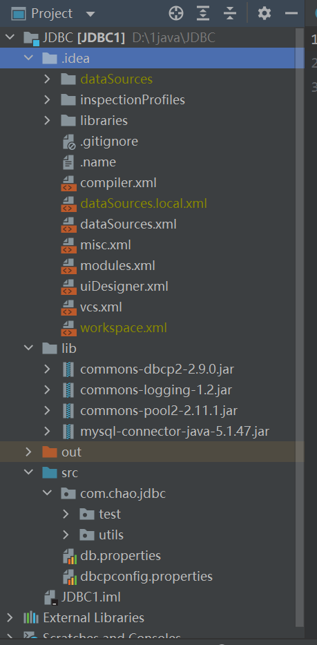

# 一轮笔记

## IO

1. ```java
   package com.chao.IO;
   
   import java.io.BufferedOutputStream;
   import java.io.DataOutputStream;
   import java.io.FileOutputStream;
   
   public class DataOutputDemo {
       public static void main(String[] args) {
           DataOutputStream dos = null;
           try{
               dos = new DataOutputStream(new BufferedOutputStream(new FileOutputStream("d:/a.txt")));
               dos.write(4);
               dos.writeChar('d');
               dos.writeUTF("你好！");
               dos.flush();
   
           }catch (Exception e){
               e.printStackTrace();
           }finally {
               try{
                   if(dos != null){
                       dos.close();
                   }
               }catch (Exception e){
                   e.printStackTrace();
               }
           }
       }
   }
   
   
   package com.chao.IO;
   
   import java.io.RandomAccessFile;
   
   public class RandomAccessFileDemo {
       public static void main(String[] args) {
           RandomAccessFile raf = null;
           try{
               raf = new RandomAccessFile("d:/a.txt","rw");
               //将若干数据写入到文件中
               int[] arr = new int[]{1,2,3,4,5,6,7,8,9,10};
               for(int i = 0;i<arr.length;i++){
                   raf.writeInt(arr[i]);
               }
               raf.seek(4);
               System.out.println(raf.readInt());
   
   
               System.out.println("-----------------------------");
               //在第8个字节位置插入一个新的数据66，替换之前是3
               raf.seek(8);
               raf.writeInt(66);
               //隔一个读一个数据
               for(int i = 0;i<10;i++){
                   raf.seek(i*4);
                   System.out.println(raf.readInt()+"\t");
               }
           }catch (Exception e){
               e.printStackTrace();
           }finally {
               try{
                   if(raf != null){
                       raf.close();
                   }
               }catch (Exception e){
                   e.printStackTrace();
               }
           }
       }
   }
   
   
   
   
   
   
   
   //bufferedReader
   package com.chao.IO;
   
   import java.io.BufferedReader;
   import java.io.FileReader;
   
   public class BufferedReadDemo {
       public static void main(String[] args) {
           FileReader fr = null;
           BufferedReader br =null ;
           try{
               fr = new FileReader("d:/a.txt");
               br = new BufferedReader(fr);
               String temp = "";
               while((temp = br.readLine()) != null){
                   System.out.println(temp);
               }
           }catch (Exception e){
               e.printStackTrace();
           }finally {
               try{
                   if(br!= null){
                       br.close();
                   }
                   if(fr != null){
                       fr.close();
                   }
               }catch (Exception e){
                   e.printStackTrace();
               }
           }
       }
   }
   
   
   package com.chao.IO;
   //bufferedWriter
   import java.io.BufferedWriter;
   import java.io.FileWriter;
   
   public class BufferedWriterDemo {
       public static void main(String[] args) {
           FileWriter fw = null;
           BufferedWriter bw = null;
           try{
               fw = new FileWriter("d:/a.txt");
               bw = new BufferedWriter(fw);
               bw.write("xiaomin");
               bw.write("wujinchao");
               bw.newLine();
               bw.write("china");
               bw.flush();
   
           }catch (Exception e){
               e.printStackTrace();
           }finally {
            try{
                   if(bw != null){
                    bw.close();
                   }
                if(fw != null){
                       fw.close();
                }
               }catch (Exception e){
                   e.printStackTrace();
               }
   
           }
       }
   }
   
   
   //对象流
   package com.chao.IO;
   
   import java.io.FileInputStream;
   import java.io.ObjectInputStream;
   
   //将对象反序列化到内存中
   public class ObjectInputStreamObjectTypeDemo {
       public static void main(String[] args) {
           ObjectInputStream ois = null;
           try{
               ois = new ObjectInputStream(new FileInputStream("d:/a.txt"));
               Users users = (Users)ois.readObject();
               System.out.println(users.getUserid()+"\t"+users.getUserage()+"\t"+users.getUsername());
           }catch (Exception e){
               e.printStackTrace();
           }finally{
               try{
                   if(ois != null){
                       ois.close();
                   }
               }catch (Exception e){
                   e.printStackTrace();
               }
           }
       }
   }
   
   
   
   
   package com.chao.IO;
   
   import java.io.FileOutputStream;
   import java.io.ObjectOutputStream;
   
   //将对象序列化到文件中
   public class ObjectOutputStreamObjectTypeDemo {
       public static void main(String[] args) {
           ObjectOutputStream oos = null;
           try{
               oos = new ObjectOutputStream(new FileOutputStream("d:/a.txt"));
               Users users = new Users(1,"jinchao","19");
               oos.writeObject(users);
               oos.flush();
           }catch (Exception e){
               e.printStackTrace();
           }finally {
               try{
                   if(oos != null){
                       oos.close();
                   }
               }catch (Exception e){
                   e.printStackTrace();
               }
           }
       }
   }
   
   
   ```
   
   ​		
   
   ​	
   
   
   
2. 容器

   ```Java
   package com.chao.container;
   
   import java.util.ArrayList;
   import java.util.List;
   
   public class ArrayListTest {
       public static void main(String[] args) {
           //实例化ArrayList容器
           List<String> list = new ArrayList<>();
           //添加元素
           boolean flag = list.add("WuJinchao");
           System.out.println(flag);
           list.add(" is ");
           list.add(2,"man.");
           System.out.println(list.get(1));
           for(int i=0;i<list.size();i++){
               System.out.print(list.get(i));
           }
           System.out.println();
   
           System.out.println(list.size());
           list.remove("uiop");
           System.out.println(list.size());
           System.out.println(list.set(1,"strong"));
           System.out.println(list.indexOf("WuJinchao"));
           System.out.println(list.contains("strong"));
         //  list.clear();
           System.out.println(list.isEmpty());
           for(String s:list){
               System.out.print(s);
           }
           //
           Object[] arr = list.toArray();
           for(int i=0;i<arr.length;i++){
               System.out.println(arr[i]);
           }
           String[] arr2 = list.toArray(new String[list.size()]);
           for(int i=0;i<arr2.length;i++){
               System.out.println(arr2[i]);
           }
   
           List<String> a = new ArrayList<>();
           List<String> b = new ArrayList<>();
           a.add("Jinchao");
           b.add("Xiaomin");
           a.add("love");
           b.add("love");
   //        System.out.println(a.addAll(b));
   //        for(String s1:a){
   //            System.out.println(s1);
   //        }
   //        System.out.println('\n');
   //        System.out.println(a.retainAll(b));
   //        for(String s2:a){
   //            System.out.println(s2);
   //        }
           System.out.println(a.removeAll(b));
          for(String s3:a){
              System.out.println(s3);
          }
   
       }
   }
   
   
   
   
   package com.chao.container;
   
   import java.util.ArrayList;
   import java.util.Collections;
   import java.util.List;
   
   public class CollectionSortTest {
       public static void main(String[] args) {
           List<String> list = new ArrayList<>();
           list.add("cde");
           list.add("b");
           list.add("d");
           list.add("a");
           //通过Collection工具类中的sort方法
           Collections.sort(list);
           for(String s:list){
               System.out.println(s);
           }
           System.out.println("------------------------------");
           List<String> list2 = new ArrayList<>();
           list2.add("a");
           list2.add("b");
           list2.add("c");
           list2.add("d");
           //洗牌
           Collections.shuffle(list2);
           for(String s:list2){
               System.out.println(s);
           }
       }
   }
   
   
   
   
   package com.chao.container;
   
   import java.util.LinkedList;
   
   public class LinkedListTest {
       public static void main(String[] args) {
           LinkedList<String> list = new LinkedList<>();
           list.add("jinchao");
           list.add("China");
   
           for(String s:list){
               System.out.print(s);
           }
           System.out.println();
           list.add(1,"love");
           System.out.println(list.isEmpty());
           list.addFirst("wjc");
           list.addLast("中国");
           System.out.println(list.getFirst());
           System.out.println(list.get(1));
           System.out.println(list.removeFirst());
           System.out.println(list.getLast());
           System.out.println(list.removeLast());
           System.out.println(list.pop());
           for(String s:list){
               System.out.print(s);
           }
   
   
       }
   }
   
   
   
   package com.chao.container;
   
   public class MySinglyList <E> implements MyList<E> {
   
       //定义单向链表的结点对象
       class Node<E> {
           private E item;
           private Node next;
   
           Node(E item, Node next) {
               this.item = item;
               this.next = next;
           }
       }
   
       private Node head;
       private int size;
   
       @Override
       public void add(E element) {
           //创建结点
           Node<E> node = new Node<>(element, null);
           //找到尾结点
           Node tail = getTail();
           //结点的连接
           if (tail == null) {
               this.head = node;
           } else {
               tail.next = node;
           }
           //记录元素个数
           this.size++;
       }
   
       private Node getTail() {
           if (this.head == null) {
               return null;
           }
           Node node = this.head;
           while (true) {
               if (node.next == null) break;
               node = node.next;
           }
           return node;
       }
   
       @Override
       public E get(int index) {
           this.checkindex(index);
           Node<E> node = this.getNode(index);
           return node.item;
       }
   
       //根据位置获取结点
       private Node getNode(int index) {
           Node<E> node = this.head;
           for (int i = 0; i < index; i++) {
               node = node.next;
           }
           return node;
       }
   
   
   
       private void checkindex(int index){
           if(!(index>=0&&index<size)){
               throw new IndexOutOfBoundsException("Index: "+index+" size: "+size);
           }
       }
   
       @Override
       public int size() {
           return this.size;
       }
   
       @Override
       public E remove(int index) {
           this.checkindex(index);
           Node<E> node = this.getNode(index);
           E item = node.item;
           //判断当前删除的结点是否为头结点
           if(this.head == node){
               this.head = node.next;
           }else{
               Node<E> temp = this.head;
               for(int i=0;i<index-1;i++){
                   temp = temp.next;
               }
               temp.next = node.next;
           }
           node.next = null;
           this.size--;
           return item;
       }
   
       public static void main(String[] args) {
           MySinglyList<String> mySinglyList = new MySinglyList<>();
           mySinglyList.add("a");
           mySinglyList.add("b");
           mySinglyList.add("c");
           mySinglyList.add("d");
   
           System.out.println(mySinglyList.size());
           System.out.println(mySinglyList.remove(1));
           for(int i=0;i< mySinglyList.size();i++){
               System.out.println(mySinglyList.get(i));
           }
       }
   }
   
   
   
   package com.chao.container;
   
   import java.util.Set;
   import java.util.TreeSet;
   
   public class TreeSetTest {
       public static void main(String[] args) {
   
           Set<String> set = new TreeSet<>();
           set.add("c");
           set.add("a");
           set.add("c");
           set.add("b");
           for(String s:set){
               System.out.println(s);
           }
           System.out.println("-----------------------");
   
           Set<Users> set1 = new TreeSet<>();
           Users u1 = new Users("jinchao",19);
           Users u2 = new Users("xiaomin",18);
           Users u3 = new Users("chucheng",18);
           set1.add(u3);
           set1.add(u1);
           set1.add(u2);
           for(Users u:set1){
               System.out.println(u);
           }
   
           System.out.println("------------------------------");
   
           Set<Student> set2 = new TreeSet<>(new StudentComparator());
           Student s1 = new Student("jinchao",19);
           Student s2 = new Student("xiaomin",18);
           Student s3 = new Student("zhucheng",18);
           set2.add(s1);
           set2.add(s2);
           set2.add(s3);
           for(Student s:set2){
               System.out.println(s);
           }
   
   
       }
   }
   
   
   
   package com.chao.container;
   
   import java.util.HashSet;
   import java.util.Set;
   
   public class HashSetTest {
       public static void main(String[] args) {
           Set<String> set = new HashSet<>();
           set.add("a");
           set.add("b");
           set.add("c");
           set.add("a");
           System.out.println(set.remove("c"));
           //在Set容器中无索引，所以没有get()
           for(String s:set){
               System.out.println(s);
           }
           System.out.println("---------------------");
   
           Set<Users> set1 = new HashSet<>();
           Users u1 = new Users("jinchao",19);
           Users u2 = new Users("jinchao",19);
           set1.add(u1);
           set1.add(u2);
           System.out.println(u1.hashCode());
           System.out.println(u2.hashCode());
           for(Users s:set1){
               System.out.println(s);
           }
   
   
   
   
       }
   
   }
   
   ```

3. 配置

   ```java
   #????
   driverClassName=com.mysql.jdbc.Driver
   url=jdbc:mysql://localhost:3306/jdbcstudy?useUnicode=true&characterEncoding=utf8&useSSL=false
   username=root
   password=123456
   
   #<!-- ????? -->
   initialSize=10
   
   #??????
   maxActive=50
   
   #<!-- ?????? -->
   maxIdle=20
   
   #<!-- ?????? -->
   minIdle=5
   
   #<!-- ???????????? 6000??/1000??60? -->
   maxWait=60000
   #JDBC?????????????????????????????=property;?
   #???"user" ? "password" ????????????????????????
   connectionProperties=useUnicode=true;characterEncoding=UTF8
   
   #??????????????????auto-commit????
   defaultAutoCommit=true
   
   #driver default ????????????????read-only????
   #???????????setReadOnly?????????????????????????Informix?
   defaultReadOnly=
   
   #driver default ??????????????????TransactionIsolation??
   #??????????????javadoc??NONE,READ_UNCOMMITTED, READ_COMMITTED, REPEATABLE_READ, SERIALIZABLE
   defaultTransactionIsolation=READ_UNCOMMITTED
       
       
       
       
       
       package com.chao.jdbc.utils;
   
   import org.apache.commons.dbcp2.BasicDataSource;
   import org.apache.commons.dbcp2.BasicDataSourceFactory;
   
   import java.io.InputStream;
   import java.sql.Connection;
   import java.sql.ResultSet;
   import java.sql.SQLException;
   import java.sql.Statement;
   import java.util.Properties;
   
   public class JDBCUtils_DBCP {
   
       private static BasicDataSource dataSource = null;
   
       static{
           try{
               InputStream in = JDBCUtils_DBCP.class.getClassLoader().getResourceAsStream("dbcpconfig.properties");
               Properties properties = new Properties();
               properties.load(in);
   
               dataSource = BasicDataSourceFactory.createDataSource(properties);
   
   
           }catch (Exception e){
               e.printStackTrace();
           }
       }
   
       public static Connection getConnection() throws SQLException {
           return dataSource.getConnection();
       }
       
       public static void release(Connection conn, Statement st, ResultSet rs){
           if(rs != null){
               try{
                   rs.close();
               }catch (SQLException e){
                   e.printStackTrace();
               }
               try{
                   st.close();
               }catch (SQLException e){
                   e.printStackTrace();
               }
               try{
                   conn.close();
               }catch (SQLException e){
                   e.printStackTrace();
               }
           }
       }
   }
   
   
   
   
   package com.chao.jdbc.test;
   
   import com.chao.jdbc.utils.jdbcUtils;
   
   import java.sql.Connection;
   import java.sql.PreparedStatement;
   import java.sql.SQLException;
   
   public class TestPreparedStatement {
       public static void main(String[] args) {
           Connection conn = null;
           PreparedStatement st = null;
   
   
           try{
               conn = jdbcUtils.getConnection();
               //区别
               //使用？ 占位符代替参数
               String sql = "insert into users(id,`NAME`,`PASSWORD`,`email`,`birthday`)values(?,?,?,?,?)";
               st = conn.prepareStatement(sql); //预编译SQL，先写sql,然后不执行
   
               //手动给参数赋值
               st.setInt(1,6);
               st.setString(2,"chao");
               st.setString(3,"112345");
               st.setString(4,"234@23.com");
               st.setString(5,"1980-12-30");
               //注意点：sql/date   数据库
               //          utils.Date  java    new Date().getTime() 获得时间戳
               int i = st.executeUpdate();
               if(i>0){
                   System.out.println("插入成功！");
               }
   
           }catch (SQLException e){
               e.printStackTrace();
           }finally{
               jdbcUtils.release(conn,st,null);
           }
       }
   }
   
   
   
   
   package com.chao.jdbc.test;
   
   import com.chao.jdbc.utils.jdbcUtils;
   
   import java.sql.Connection;
   import java.sql.ResultSet;
   import java.sql.SQLException;
   import java.sql.Statement;
   
   public class TestSelect {
       public static void main(String[] args) {
           Connection conn = null;
           Statement st = null;
           ResultSet rs = null;
           try{
               conn = jdbcUtils.getConnection();
               st = conn.createStatement();
               String sql = "select * from users where id = 2";
               rs = st.executeQuery(sql);
               while(rs.next()){
                   System.out.println(rs.getString("NAME"));
   
               }
           }catch (SQLException e){
               e.printStackTrace();
           }finally{
               jdbcUtils.release(conn,st,rs);
           }
       }
   }
   
   
   
   
   package com.chao.jdbc.test;
   
   import com.chao.jdbc.utils.JDBCUtils_DBCP;
   
   import java.sql.Connection;
   import java.sql.PreparedStatement;
   import java.sql.SQLException;
   
   public class TestDbcp {
       public static void main(String[] args) {
           Connection conn = null;
           PreparedStatement st = null;
   
   
           try{
               conn = JDBCUtils_DBCP.getConnection();
               //区别
               //使用？ 占位符代替参数
               String sql = "insert into users(id,`NAME`,`PASSWORD`,`email`,`birthday`)values(?,?,?,?,?)";
               st = conn.prepareStatement(sql); //预编译SQL，先写sql,然后不执行
   
               //手动给参数赋值
               st.setInt(1,7);
               st.setString(2,"chao");
               st.setString(3,"112345");
               st.setString(4,"234@23.com");
               st.setString(5,"1980-12-30");
               //注意点：sql/date   数据库
               //          utils.Date  java    new Date().getTime() 获得时间戳
               int i = st.executeUpdate();
               if(i>0){
                   System.out.println("插入成功！");
               }
   
           }catch (SQLException e){
               e.printStackTrace();
           }finally{
               JDBCUtils_DBCP.release(conn,st,null);
           }
       }
   }
   
   ```

   

   