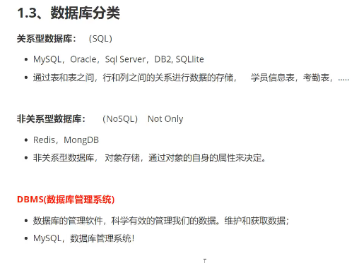
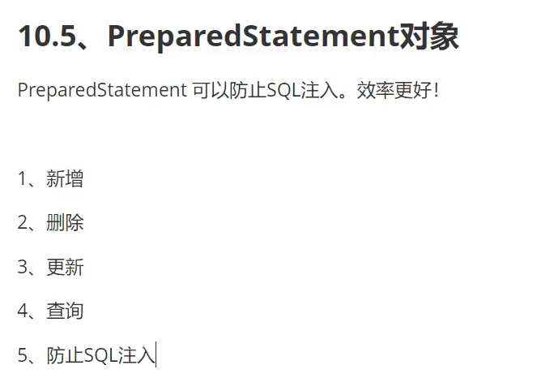

# 数据库MySQL

## ##一、

1. 

2. 

3. 

4. sql 的基本命令行操作

5. 数据库的列类型：数值：字符串：    时间日期：    null：

   

6. **数据库的字段属性**

   

7. 创建数据库表

8. 数据表的类型

   

   

9. 修改删除表

   
   
10. DML语句

    

    

    

    

    

11. DQL查询数据（最重点）

    

    

    
    
    
    
12. 联表查询

13. 分页和排序

    

    

14. 子查询

    
    
15. 

16. 数据库级别的MD5加密

    

## ##二、事务

1. 

2. 事务的原则

3. 执行事务

   模拟转账

   

## ##三、索引

1. 
2. 

3. 

   

4. 用户管理，在mysql.user文件可查看用户信息

5. 三大范式

## ##四、JDBC

1. 
2. 将1中的大部分代码封装成一个工具类和配置文件
3. SQL注入问题
4. 

5. 

   