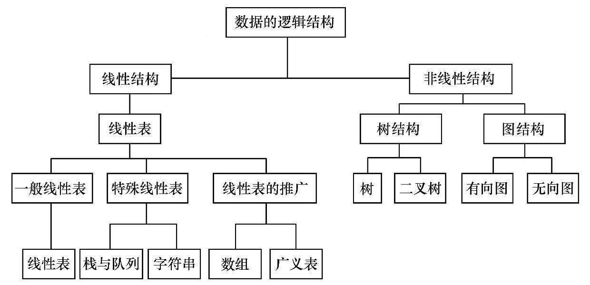

# 数据结构（C语言）

## ##一、基本概念

1. 数据Data  是所有能输入计算机并被处理的符号的总称。

2. 数据元素Data  Element  是数据的基本单位，在计算机中通常作为一个整体进行考虑和处理。

3. 数据项Data Item 是组成数据元素的、不可分割的最小单位。

4. 数据对象Data  Object 是性质相同的数据元素的集合，是数据的一个子集。

5. 数据结构Data Structure是相互之间存在一种或多种特定关系的数据元素的集合。即带结构（指数据元素之间存在的关系）的数据元素的集合。

6. 数据结构包括逻辑结构和存储结构。

7. 逻辑结构是从逻辑关系上描述数据，是独立于计算机的。逻辑结构的两大要素：数据元素和关系。**根据数据元素之间关系的不同特性，通常有4类基本结构：集合结构、线性结构、树结构、图结构。其中，集合结构、树结构、图结构都属于非线性结构。**

8. 存储结构：数据对象在计算机中的存储表示称为数据的存储结构（物理结构）。***把数据对象存到计算机时既要存各数据元素又要存储数据元素之间的逻辑关系，数据元素在计算机内用一个结点来表示***。数据元素在计算机中有2种基本存储结构：**顺序存储结构和链式存储结构**。

9. 顺序存储结构是借助元素在存储器中的相对位置来表示数据元素之间的逻辑关系，通常借助数组类型来描述。

10. 链式存储结构无需占用一整块存储空间，但为了表示结点之间的关系。需要给每个结点附加指针字段，用于存放后继元素的存储地址，通常借助指针类型来描述。**每个结点一般占用2个连续的存储单元，一个存放结点的信息，一个存放后继结点的首地址。**

11. 数据类型Data Type 是高级程序设计语言的一个基本概念，是一个值的集合和定义在这个值集上的一组操作的总称。

12. 抽象数据类型Abstract  Data  Type（ADT）一般指由用户定义的、表示应用问题的数学模型，以及定义在这个模型上的一组操作的总称，具体包括3部分：**数据对象、数据对象上关系的集合、对数据对象的基本操作的集合。**

    ```c
    //抽象数据类型的定义格式
    ADT 抽象数据类型名{
       数据对象：〈数据对象的定义〉
       数据关系：〈数据关系的定义〉
       基本操作：〈基本操作的定义〉
    }ADT 抽象数据类型名
    //数据对象和数据关系的定义采用数学符号和自然语言描述，基本操作的定义如下
    基本操作名（参数表）
       初始条件：〈初始条件描述〉
       操作结果：〈操作结果描述〉
    //基本操作有2种参数：赋值参数只为操作提供输入值；引用参数以&打头，除可提供输入值外，还将返回操作结果。初始条件描述了操作执行之前数据结构和参数应满足的条件，若为空则忽略
    ```

13. 算法Algorithm的定义：求解一个特定任务的指令的有限序列。

14. 算法的5个特征：有穷性、确定性、可行性、0或多个输入、至少一个输出。

15. 算法的4个设计要求(判断算法的优劣)：正确性、可读性、健壮性、高效与低存储量。

16. 衡量算法效率的两大方法：事后统计法和事前分析估算法。**不考虑计算机的软硬件等环境因素，影响算法时间代价的最主要因素是  问题规模——算法求解问题输入量的多少，是问题大小的本质表示，一般用整数n表示，n对不同问题含义不同，当然n 越大算法的执行时间越长。**一个算法的执行时间大致等于其所有语句执行时间的总和，而语句的执行时间则为该条语句的重复执行次数和执行一次所需时间的乘积。**一条语句的重复执行次数称作语句频度Frequency  Count，设每条语句执行一次所需的时间均是单位时间，则一个算法的执行时间可用该算法所有语句频度之和来度量。但是计算所有语句频度过于复杂，所以只用算法中的基本语句（指算法中重复执行次数和算法的执行时间成正比的语句，它们对算法运行时间的贡献最大。*我们对算法的评价通常只需考虑算法的执行时间随问题规模增长的趋势，这种情况下，我们只需考虑问题规模充分大时，算法中基本语句的执行次数在渐进意义下的阶。*）**

17. 算法的**时间复杂度Time Complexity**：一般情况下，算法中基本语句重复执行的次数是问题规模n的某个函数f(n)，算法的时间量度记作  T(n)=O(f(n))  ,它表示随问题规模n的增大，算法执行时间的增长率和f(n)的增长率相同，即函数T(n)和f(n)具有相同的增长趋势。

18. 常见的时间复杂度按数量级递增排列依次为：常量阶O(1)、对数阶O(log2n)、线性阶O(n)、线性对数阶O(nlog2n)、平方阶O(n2)、立方阶O(n3)、……、k次方阶O(nk)、指数阶O(2n)等。

19. 最好时间复杂度：算法计算量可能达到的最小值；最坏时间复杂度：算法计算量可能达到的最大值；平均时间复杂度：算法在所有可能情况下，按照输入实例以等可能概率出现时，算法计算量的加权平均值。**通常只讨论最坏时间复杂度。**

20. 算法的空间复杂度Space Complexity ：记作  S(n)=O(f(n)) , 一般情况下，一个程序在机器上执行时，除了需要寄存本身所用的指令、常数、变量和输入数据（这些取决于问题本身，与算法无关）外，还需要一些对数据进行操作的**辅助存储空间**，**我们只需分析算法在实现时所需的辅助空间。**

21. 对于一个算法，时间复杂度与空间复杂度往往相互影响，但通常（鉴于运算空间较充足）都以时间复杂度作为算法的优劣的衡量指标。

    

## 二、线性表

1. 线性表的顺序表示（线性表的顺序存储结构或顺序映像）：用一组地址连续的存储单元依次存储线性表的数据元素。**通常，称为顺序表Sequential  List，是一种随机存取的存储结构，其特点是它的数据元素在逻辑与物理次序上都是相邻的,常用数组来描述。  LOC(ai)=LOC(a1)+(i-1)*/**

   ```c
   #define MAXSIZE 100000
   //图书表可能达到的最大长度
   typedef struct
   //图书信息定义
   {
   	char no[20];
   	//图书ISBN
   	char name[50];
   	//图书名字
   	float price;
   	//价格
   }Book;
   typedef struct
   {
   	Book *elem;
   	//存储空间的基地址或起始位置
   	int length;
   	//图书表当前个数
   }SqList;
   //图书表的顺序存储结构类型是SqList
   ```

2. 线性表的链式存储结构：用一组任意的存储单元存储线性表的数据元素，**是非随机存取（顺序存取）的存储结构**。对数据元素而言，既要存储其本身的信息（数据域）又要存储其直接后继的存储地址（指针域），这两部分信息组成数据元素的存储映像，即结点node。

3. 单链表、循环链表Circular  Linked  List、双向链表Double  Linked  List、有序表Ordered List（所有数据元素以递增或递减方式有序排列）……

4. 单链表一般有头指针、头结点（其数据域可不存储任何信息，头结点便于首元结点的处理以及对空表和非空表的统一处理）、首元结点。

5. 

6. 存储密度：数据元素本身所占用的存储量和整个结点结构所占用的存储量之比。

## ##三、栈和队列

1. 栈stack的定义：限定仅在表尾进行插入或删除操作的线性表。表尾端即栈顶top，表头端即栈底bottom，不含元素的空表称为空栈。
2. 队列queue的定义：是一种先进先出的线性表，它只允许在表的一端进行插入，在另外一端删除元素。插入的一端即队尾rear，删除的一端即队头front。