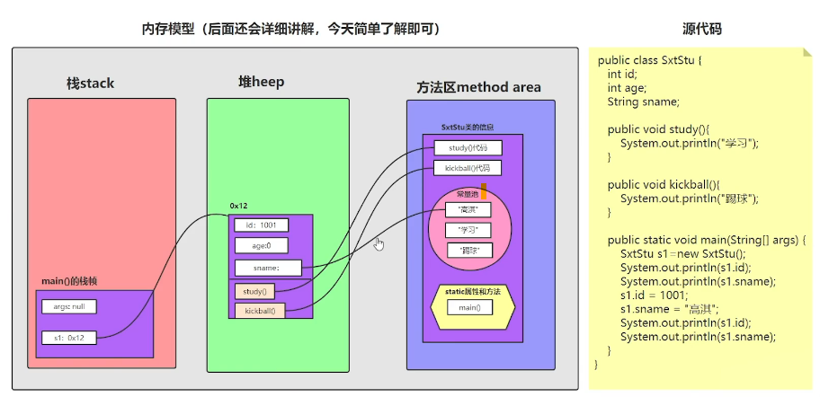
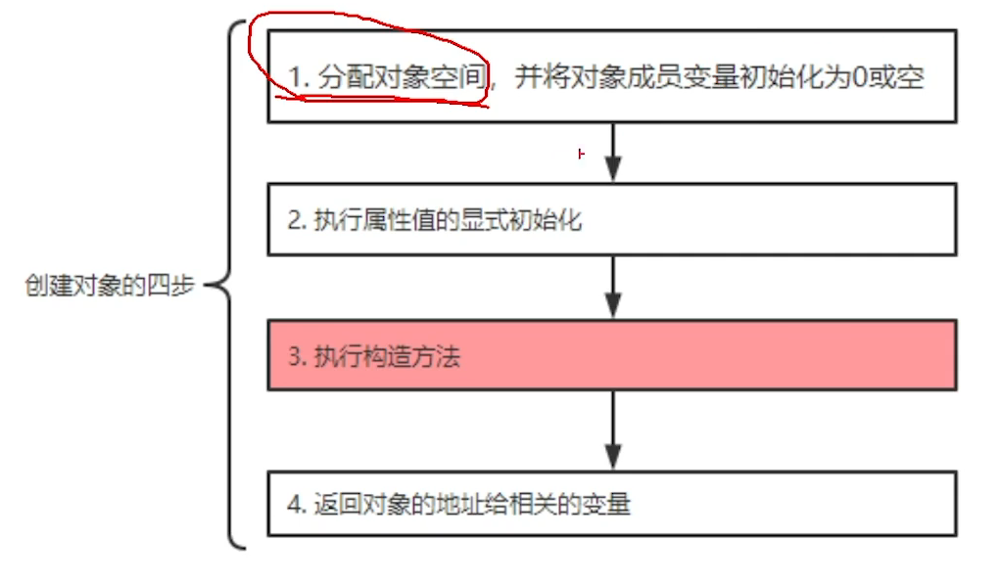
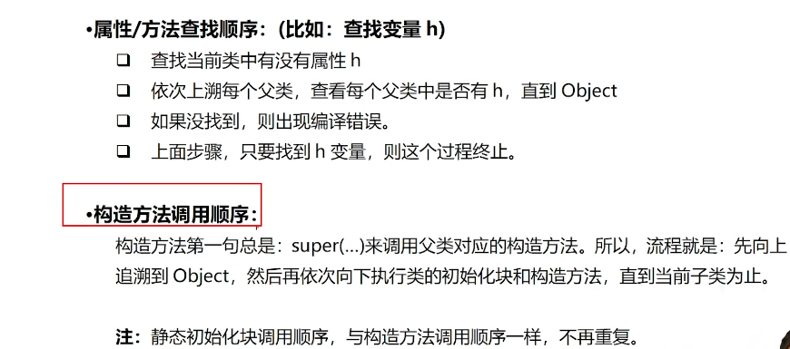
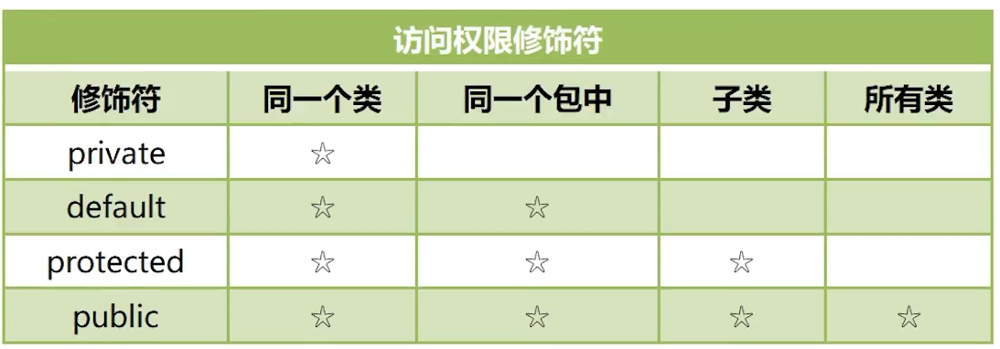

# #第一周学习记录

## ##一、java简介

 1. jdk8
 2. 跨平台性
 3. 三大版本 javase    javaee    javame
 4. java是编译型和解释型的结合。

## ##二、java运行机制

 1. 源文件.java——编译器javac——字节码文件.class——JVM虚拟机（解释器）——操作系统
 2. JVM（Java Virtual Machine）用于执行bytecode字节码文件的虚拟计算机
 3. JRE（Java Runtime Environment）含：Java虚拟机、库函数等。
 4. JDK（Java Development Kit）含：JRE、编译器、调试器等。

## ##三、变量和数据类型

 1. 基本数据类型 ：包括数值型（整数类型和浮点数类型）、字符类型、真假类型
 1.1 整数类型：byte/short/int/long, 分别1、2、4、8字节。 整数在Java中默认为int，长整数需加L—— long a=8765433222L;
 1.2 浮点数类型：float/double，分别4、8字节。浮点数默认为double，float小数需加F或f。
 1.3字符类型：char(2字节)
 1.4真假类型：boolean(一般4字节，数组时1字节)，只有true或flase
 2. 对象类型：对象是由基本数据类型、数组和其他对象组合成的一个东西。


 3. 数组类型：3种赋值形式
3.1 `int[] arr={1,2,3};`
3.2`int[] arr=new int[] {1,2,3};`
3.3`int[] arr=new int[3]; arr[0]=1; arr[1]=2;arr[3]=3;`
3.4  前两种赋值为提前已知数据内容，第三种先分配长度再赋值，若无赋值则据数据类型默认为0、false、NULL
3.5   **数组类型有2块对应的内存空间，一块放数组实际内容的起始地址，一块放数组实际内容。** 
3.6   对数组的判断，==判断的是2个是否指向同一个数组。

## ##四、运算符 operator

 1. 算术运算符
 1.1 二元运算符：+,-,*,/,%
 1.2 一元运算符：++,--

  2. 赋值运算符：=

  3. 扩展运算符：+=,-=,*=,/=

  4. 关系运算符:  <,>,>=,<=,==,!=,** instanceof**

  5. 逻辑运算符:  &&,  ||,  !,  ^

  6. 位运算符:  &,  |,  ^,  ~,  <<,  >>,  >>>

  7. 条件运算符: ? :

  8. 字符串连接符:  +

  9. 优先级：小括号>一元运算符>算术运算符>**位移位**运算符>关系运算符>**位逻辑**运算符>逻辑运算符>条件运算符>赋值运算符、扩展运算符。

  10. 计算机中浮点数（用二进制表示小数，采用类似科学计数法、形如  m*(2^e) ，m称为尾数，e称为指数，指数可正可负，在二进制中，单独表示尾数部分和指数部分，另外还有一个符号位表示正负）

  11. 计算机中整数用二进制补码表示：原码即最高位为符号位，0表正1表负，保持不变。 **正数的原码、反码、补码都相同，无需变。**   负数的反码即符号位不动，只取反不加1，在反码上加1即得到补码。     负数的补码为其原码取反加1（取反加1时符号位不动），对补码再取反加1即得到原码。

  12. 位运算**（二进制运算，在Java中整数以二进制补码表示）**分为：移位运算和逻辑运算。

  13. 移位运算：**左移<<**，右边低位补0，高位舍去，将二进制看作十进制，***左移1位相当于乘2***；      **无符号右移>>>**，右边舍去，左边补0；    **有符号右移>>**，右边舍去，左边补符号位（即正数补0，负数补1），***右移1位相当于除以2。***

  14. 逻辑运算：&按位与：两位为1才为1；    |按位或：有一位为1即为1；   ~按位取反：0变1，1变0；   ^按位异或：异1同0。

  15. 

 16. **整数常量是int类型，但可以自动转换成byte/short/char。**

 17. 强制类型转换（又称造型cast，可能损失精度）

       12.1	浮点数强制转换从整数时，直接丢失小数部分。

       12.2	强制转型，超过了表数范围，会转成一个完全不同的值。

## ##五、条件执行

1. ```java
   if(条件语句){
   	代码块
   }
   ```

2. `if(条件语句)代码块`

3. `if(){`
   `}else{}`

4. 条件运算：判断条件？表达式1：表达式2；

5. switch语句

   ```java
   switch(){
   	case 值1 :
   		代码;break;
   	...
   	default:代码;
   }
   ```

##  ##六、循环执行

1. `while(){`
   `}`

2. `do{`
   `}while()`

3. `for(初始化语句;循环语句;步进操作){`
   循环体`}`

4. ```java
   int[] arr={1,2,3}; for(int element=arr){
   	System.out.println(element);
   }
   ```

5. break可用于提前结束循环

6. continue 会跳过循环体剩下的代码，然后步进操作。

## ##七、函数的用法

1. 基本概念

   ```java
   修饰符 返回值类型 函数名(参数类型 参数名, ...){
   	操作
   	return 返回值
   }
   ```

   1.1   return 可以在函数的任意地方，结束函数，返回调用方，且最多返回一个值(可以为数组或对象)。

   1.2   数组和可变长度的参数可作为函数参数

   1.3   任何函数都要放在类中，程序的入口为main函数

   ```
   public static void main(String[] args){		}
   	//args 表示从控制台接收到的参数
   ```

2. 栈的概念：栈是一块内存，一般先进后出，往栈里面放数据即入栈，最下面为栈底，最上面为栈顶，从栈顶拿出数据即出栈。栈一般是从高位地址向地位地址扩展，即栈底的内存地址最高，栈顶的最低的。

   2.1	计算机系统用栈来存放函数调用过程中需要的数据，包括参数、返回地址、函数内定义的局部变量。每调用一次函数就分配栈空间。

   2.2	数组和对象存放地址的空间分配在栈上，放实际内容的空间分配在堆上。

   2.3	栈溢出(栈的空间有限)——java.lang.StackOverFlowError            

## ##八、字符的编码与乱码

1. 编码两大类：unicode编码与非unicode编码。
2. 非Unicode编码中ASCII码是基础，采用一个字节8位表示，最高位设位0，其他7位表示128个字符。其他编码都是兼容ASCII的，最高位使用1来进行区分。
3. Unicode给世界上所有字符都规定了一个统一的编号，其编号范围达到110多万，但其本身并无规定这个 编号如何对应到二进制形式。而UTF-32/UTF-16/UTF-8都是将Unicode编号对应到二进制形式，只是方法不同。UTF-32使用4个字节，UTF-16大部分是2个字节，少部分是4个字节，它们都不兼容ASCII编码，都有字节顺序的问题。UTF-8使用1~4个字节(变长字节)表示，兼容ASCII编码，一般英文用1个字节，其他用2个字节，中文大多用3个字节。
4. 编码转换：一个字符从A编码转到B编码，先找到字符的A编码格式，通过A的映射表（每种编码都有一个映射表来存储其特有的字符编码和Unicode编号之间的对应关系）找到Unicode编号再查B的映射表，找到字符的B编码格式。    **编码转换改变了字符的二进制内容，但并没有改变字符的样子**
5. 乱码的原因：解析错误或者在错误解析的基础上进行编码转换。

## ##九、类的基础

1. 除了8种基本数据类型，其他类型的数据都用类这个概念表示。**类既是函数的容器又是自定义数据类型。**

2. 一个数据类型主要由4部分组成：

   2.1	类型本身具有的属性，通过**类变量（静态变量）**体现。

   2.2	类型本身可以进行的操作，通过**类方法（静态方法）**体现。

   2.3	类型实例具有的属性，通过**实例变量**体现。

   2.4	类型实例可以进行的操作，通过**实例方法**体现。

3. 类变量和实例变量都叫成员变量，即类的成员。类方法和实例方法都叫成员方法，即类的成员。

4. 定义一个类

   ```java
   public class Point{
   	public int x;//定义了实例变量(不能用static修饰符) x,y表示坐标，public表示可被外部访问。
   	public int y;
   	public double distance(){//定义了实例方法distance，表示距离
   		return Math.sqrt(x*x+y*y);
   	}
   }
   ```

   ```java
   public static void main(String[] args){
   	Point p=new Point();//该语句包含POint类型的变量声明和赋值，可分为POint p; p=new Point();
   	p.x=2;
   	p.y=3;
   	System.out.println(p.distance());
   }
   ```

   4.1  **Point  p;  声明了一个叫p的Point类型变量。这种变量与数组类似，都有2块内存：一块存放实际内容，一块存放实际内容的位置。声明变量只会分配存放位置的内存空间，这块空间还没有指向任何实际内容。因为这种变量与数组变量本身不存储数据，而只是存储实际内容的位置，它们也称为引用类型的变量。**

   4.2   p=new Point();  创建了一个实例或对象，然后赋值给了Point类型的变量p，它至少做了两件事：（1）分配内存，以存储新对象的数据，对象数据包括这个对象的属性，具体包括其实例变量x和y。（2）给实例变量设置默认值，int类型默认为0。**默认值可以在定义变量时修改（即赋值）。**

   4.3	*与方法内定义的局部变量不同，在创建对象时，所有实例变量都会分配一个默认 ull。null表示不指向任何对象。*

   4.4	对实例变量和实例方法的访问都通过对象进行。

5. **每一个源文件都必须有且只有一个public  class ，并且类名与文件名相同。一个java 文件可以同时定义多个class。**

6. **一个类有3种成员：属性field，方法method，构造器constructor。**

7.  内存分析

8. 创建对象

   

   ​	

9. **java虚拟机内存模型**：分为3个区域，栈stack、堆heap、方法区method area。     **一个程序有多个线程，每一个线程都有一个程序计数器（计算栈执行到哪一行）、一个虚拟机栈（即栈空间，存放执行的方法）、一个本地方法栈（调用操作系统方法），而且一个线程对应一个栈、一个方法对应一个栈帧。对于一个程序，堆和方法区都是唯一的。**  

   9.1	栈的特点：存储上先进后出、后进先出。栈有相同自动分配，速度快。栈是一个连续的内存空间。

   9.2	堆的特点：存储创建好的对象（数组也是对象），JVM只有一个堆，被所有线程共享，堆是一个不连续的内存空间、分配灵活、速度慢。

   9.3	方法区本质上也是堆。

10. **垃圾回收制度**（garbage  collection），大大提高了开发效率、解决了内存管理的问题。

    10.1	Java的内存管理主要是对堆中对象的管理，一是对象空间的分配（使new创建对象），二是对象空间的释放（将对象赋值位null）。

    10.2	垃圾回收的常见方法：引用计数法和引用可达法（根搜索法）。

    10.3	通用的分代垃圾回收机制：堆内存分为年轻代、年老代和永久代。年轻代又分为Eden区和survivor区。minor GC 清理年轻代，将有用的对象复制到survivor区，major  GC 清理年老代，full GC清理年轻代、年老代、永久代，成本较高。

    10.4	内存泄漏：指堆内存由于某种原因未释放，造成内存浪费，导致运行速度减慢甚至系统崩溃等。

    10.5	已造成内存泄漏的原因：

    ​			a.	创建大量无用对象；

    ​			b.	静态集合类的使用；

    ​			c.	链接对象未关闭

    ​			d.	监听器使用不当。

11.    this关键字  是每个普通方法的隐式参数，即当前对象本身（对象的地址）。

12. ​    final关键字  的作用： a.修饰变量：一旦赋值则不可再更改。     b.修饰方法：不可被子类重写（override）。c.修饰类：不可被继承。

13. ​    static关键字声明的属性与方法属于类，普通的属性与方法属于对象。

    ​	static声明的东西的特点：

    ​		a.	为该类的公用变量，属于类，被该类的所有对象共享，在类载入				时被初始化。

    ​		b.	static变量只有一份，与对象可多个不同。

    ​		c.	一般用类名.类方法/变量 来调用。

    ​		d.	在static方法中不可直接访问非static成员。	
    
14.    super关键字：可以看做是直接父类对象的引用。在一个类中，若构造方法的第一行无调用super(...)或this(...)，那么Java会默认调用super()，即调用父类的无参构造器，这也是类的追溯的原因。

## ##十、包机制、继承、组合、封装、多态

​	        *面向对象编程的三大特征：继承、封装、多态*

1. 包相当于文件夹对文件的作用，用于管理类以及解决类的重名问题。

2. 包名（域名倒着写，再加上模块名，便于内部管理类）放在类的第一句，写项目都要加包，不要使用默认包。例如：com.gao.car

3. 导入类import：Java会默认导入Java.lang包下所有类，可以直接使用。若导入2个同名的类，只能用包名+类名来调用这个类。

4. import.java.util.*   会导入该包下所有类，会降低编译速度，但不会降低运行速度。

5. 静态导入：import  static  java.lang.Math.*   导入Math类下的所有静态属性和方法。import  static  java.lang.Math.PI   只导入Math类下的PI，这个静态属性。

6. **object类中toString()，默认返回对象的地址，可以重写toString()返回对象的某内容；object类中的equals()，默认是比较两个对象的hashcode（地址），并返回true或者false，可以通过重写修改所要比较的两个对象的某内容。**

7. 继承的作用：代码复用、更易实现类的扩展；方便建模。

8. **instanceof  是二元运算符，左边为对象，右边为类，用来判断某对象是否属于某个类，结果为true或false。**

9. Java中类只有单继承，接口则有多继承；子类（派生类）继承父类（超类、基类），可以得到父类的全部属性和方法（除了父类的构造方法），但不一定可以直接访问（例如：父类私有的属性和方法）；定义一个类时，若无extends，则其父类被默认为：Java.lang.Object。

10. 组合的核心：将父类的对象作为子类的属性。

    ```java
    public class Test {
    	public static void main(String[] args){
    		sun k2 = new sun();
    		System.out.println(k2.k1.a);
    	}
    }
    class father{
    	int a=8;
    }
    class sun{
    	father k1 = new father();
    }
    ```

11. 封装encapsulation的优点：提高代码的安全性、复用性，高内聚、低耦合的理念。

12. 封装使用访问控制符private、default、protected、public，来实现。

13. 开发中封装的简单规则：a.  **属性**：一般用private，私有后，用get/set方法来访问，这些方法一般是public（Boolean变量的get方法是is开头）。b. **方法**：   一般只用于本类的使用private，希望被外调用的使用public。  

14. **多态**polymorphism：同一个方法调用，不同对象的行为完全不同。

15. 多态存在的3个必要条件：继承、方法重写、父类引用指向子类对象。

    ```java
    package com.chao.test;
    
    public class test2 {
        public void shout(){
            System.out.println("叫了一声");
        }
    
    }
    class Dog extends test2{
       public void shout(){
           System.out.println("汪汪汪");
       }
       public void seeDoor(){
           System.out.println("看门中");
       }
    }
    class Cat extends test2{
        @Override
        public void shout() {
            System.out.println("喵喵喵");
        }
    }
    //package com.chao.test;
    
    public class test3 {
        public static void main(String[] args) {
            Cat cat = new Cat();
            animalcry(cat);
            animalcry(new Dog());
            test2 b = new Dog();
            b.shout();
            test2 c = (test2)b;
            c.shout();
        }
        static  void animalcry(test2 a){//test2 a = new Cat()
            a.shout();
        }
    }
    
    ```

    

16. 对象的转型casting：向上转型：自动类型转换，子类转成父类；向下转型：强制类型转换，父类转成子类。      转型时要注意对象实质上（运行时）的类型。        

## ##十一、常见DOS（Disk Operating System）命令

1. cd 目录路径
2. cd..   进入父目录
3. dir   查看本目录下的文件和子目录列表
4. cls   清屏
5. 上下键   查看以前命令
6. Tab键     自动补齐命令


