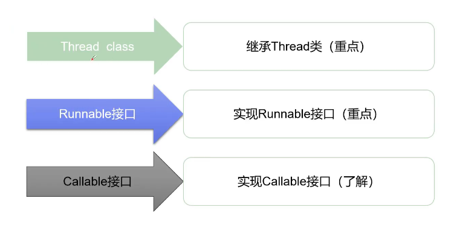
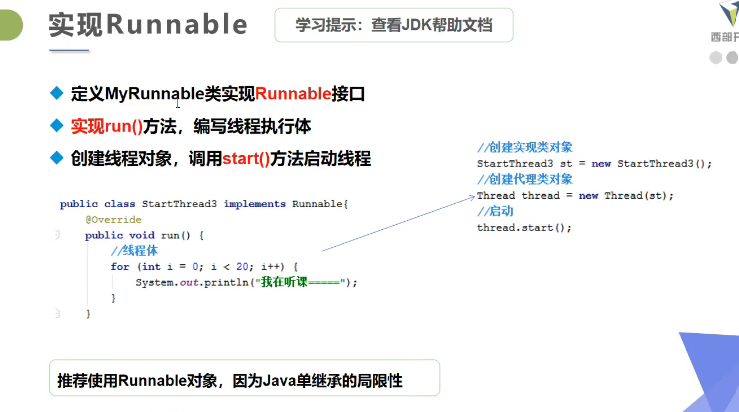

#  第三周学习记录

## ##一、容器Collection集合

### ###1.1 容器的结构

1. 容器的结构


### ###1.2   单例集合List接口

1. ~~容器结构图~~

2. 单例集合的使用：Collection是单例集合根接口，有2个子接口List、Set接口。

3. List接口特点：有序（List中每个元素都有索引标记，看根据标记访问元素）、可重复（元素可以重复）。

4. ArrayList线程不安全、效率高。   Vector线程安全、效率低。
   ArrayList 是 Java 编程语言中的一个类，用于存储一组动态大小的对象。它是 List 接口的一个实现，可以用来代替传统的数组，提供更加灵活的数据存储和操作方式。
   ArrayList 的特点：
   动态扩容：ArrayList 内部使用数组作为数据存储结构，当元素数量超过数组长度时，ArrayList 会自动扩容，重新分配更大的数组空间。
   可变大小：与传统数组不同，ArrayList 的大小可以动态地增加或减少，无需手动调整数组大小。
   线程不安全：ArrayList 不是线程安全的，不能在多线程环境下直接使用。如果需要在多线程环境下使用 ArrayList，可以使用 Collections.synchronizedList 方法或者使用并发安全的容器类，如      CopyOnWriteArrayList。

5. stack栈容器，是Vector的一个子类

6. **Java的对对象引用实际上类似于指针**

   ```java
   People p1 = null;
   	//p1类似一个指针，此时=null，不指向任何内存空间
   People p2 = new People();
   	//new关键字实际上分配（开辟）了内存空间，并把该内存空间的基址赋给p2，使p2指向该内存空间
   p1 = p2;
   	//把p2赋给p1，使p1也指向了new分配的内存空间
   
   ```

7. Set接口特点：无序、不可重复。无序指Set中的元素没有索引，只能遍历查找。

8. Set常用的实现类：HashSet、TreeSet等，我们一般使用HashSet。

9. HashSet是一个没有重复元素的集合，不保证元素的顺序，而且HashaSet允许有null元素。HashSet采用哈希算法实现，底层实际用HashMap实现（HashSet本质就是一个简化版的HashMap），因此，查询效率和增删效率都较高，线程不安全。

10. Hash算法（散列算法）原理：取模运算、越散越好

11. 无序：HashSet中底层是使用HashMap存储元素，HashMap底层使用数组和链表存储元素。元素在数组中存储时，并不是有序存放也不是随机存放，而是对元素的哈希值（同一元素的哈希值相同）进行运算决定元素在数组中的位置。**实际上，是先把元素放到Node类结点，再把Node类结点放到数组中。**

12. 不重复：当两个元素的哈希值进行运算后 得到相同的在数组中的位置，会调用元素的equals()方法判断两个元素是否相同。如果元素相同则不会添加元素，如果不相同则会使用单向链表保存该元素（**让数组中与其比较的Node类结点指向该元素）。**

13. TreeSet容器类：是一个对元素进行排序的容器。底层是用TreeMap实现的，内部维持了一个简化版的TreeMap，通过key来存储Set的元素。TreeSet内部需要对存储的元素进行排序，因此，我们需要给定排序规则。**排序规则实现方式：1.通过元素自身实现比较规则。  2.通过比较器指定比较规则。**

14. 在元素自身实现比较规则时，需要实现Comparable接口中的compareTo方法，来定义比较规则。

15. 通过比较器定义比较规则时，我们需要单独创建一个比较器，比较器需要实现Comparable接口中的compare方法来定义比较规则。在实例化TreeSet时将比较器对象交给TreeSet来完成元素的排序处理，此时元素自身就不需要比较规则了。

### ###1.3  双例集合Map接口

1. Map接口定义了双例集合的存储特征，即以key和value结构为单位进行存储，体现了数学中的函数y=f(x)的概念，**值value为y，键key为x。**
2. Collection中的容器，元素是孤立存在的（视为单身），是一个一个元素的方式存储的；Map中的容器，元素是成对存在的（视为夫妻），每个元素由键与值两部分组成，通过键可以找到所对应的值。**Map中的集合不能包含重复的键，值可以重复；每个键只能对应一个值。**  Map中常用的容器为HashMap、TreeMap等。
3. Map中的常用方法
4. HashMap容器类是Map接口的实现类，它采用哈希算法，是Map接口中最常用的实现类。由于底层采用哈希表存储数据，所以要求键不能重复，如果发生重复，新的值会替换旧的值。HashMap在查找、删除、修改方面都有很高的效率。
5. HashMap的底层存储：HashMap底层实现采用了哈希表，这是一种非常重要的数据结构。数据结构中由数组和链表来实现对数据的存储。数组：占用空间连续，寻址容易，查询快，增删慢。  链表：占用空间不连续，寻址困难，查询慢，增删快。**哈希表的本质就是“数组+链表”，结合了二者的优点。**  *当我们往HashMap中放第一个元素时，实际上先把元素放到一个结点对象，再把这个结点对象放到一个长度为16的数组中*
6. 在JDK1.8的HashMap中对于数组的初始化采用的是延迟初始化方式。通过resize方法实现初始化处理，resize方法既实现数组初始化，也实现数组扩容处理。**CPU在做除法和取余时，效率低下。**
7. **计算Hash值（哈希值）**：  1.获得key对象的hashcode，首先调用key对象的hashcode()方法，获得key的hashcode 值；      2.根据hashcode计算出hash值（要求在**[ 0,  数组长度-1 ]** 区间），hashcode是一个整数，我们需要将其转化成[ 0,  数组长度-1 ] 的范围，要求转换后的hash值尽量均匀分布在[ 0,  数组长度-1 ]这个区间，减少“hash冲突”。      3. 一种简单和常用的算法是（相除取余算法）：**hash值 =  hashcode%数组长度  ，**这种算法可以让hash值均匀分布在[ 0,  数组长度-1 ]区间，但该算法使用了除法，效率低下。JDK后来改进了算法，首先规定数组长度必须为2 的整数幂，这样采用**位运算**即可实现取余的效果：**hash值=hashcode&（数组长度-1）。**实际上，这个过程先得到元素的hashcode,然后将hashcode与(hashcode>>>16)做异或^运算，再将这个运算得到的结果与（数组长度-1）做与运算&，其结果即为hash值。
8. Java集合是一组类和接口，用于在Java中存储和操作数据。集合提供了一种方便的方式来组织数据，并且具有高效的性能和灵活性。Java集合框架包含了各种集合类型，每个集合类型都有其自身的特点和用途。
Java集合框架主要分为两大类：基于数组的集合和基于链表的集合。基于数组的集合通常比较适合存储元素数量已知且不经常改变的数据，而基于链表的集合则更适合存储元素数量不确定且需要频繁添加、删除的数据。
下面是Java集合框架中一些常用的集合类型和其特点：

(1) List（列表）：List是一个有序的集合，它允许存储重复的元素。List中的元素可以根据它们在列表中的索引位置进行访问和操作。常用的List实现类有ArrayList和LinkedList。
示例代码：
List<String> list = new ArrayList<>();
list.add("apple");
list.add("banana");
list.add("orange");
System.out.println(list.get(0));  // 输出"apple"
   
(2) Set（集合）：Set是一个不允许存储重复元素的集合。Set不保证元素的顺序，因此不能根据索引来访问和操作元素。常用的Set实现类有HashSet和TreeSet。
示例代码：
Set<String> set = new HashSet<>();
set.add("apple");
set.add("banana");
set.add("orange");
System.out.println(set.contains("apple"));  // 输出true
   
(3) Map（映射）：Map是一种键值对（key-value）映射的集合，它允许根据键来访问和操作元素。Map中的键不能重复，但值可以重复。常用的Map实现类有HashMap和TreeMap。

Map<String, Integer> map = new HashMap<>();
map.put("apple", 1);
map.put("banana", 2);
map.put("orange", 3);
System.out.println(map.get("apple"));  // 输出1
   
除了以上三种常见的集合类型之外，Java集合框架还提供了其他类型的集合，如Queue（队列）、Deque（双端队列）等。每种集合类型都有其特定的应用场景，开发者应根据自身的需求选择合适的集合类型。
   
List（列表）常用方法：
add(E e)：将元素e添加到列表末尾。
add(int index, E element)：将元素element添加到指定索引位置index处。
remove(int index)：删除指定索引位置index处的元素。
set(int index, E element)：将指定索引位置index处的元素替换为element。
get(int index)：返回指定索引位置index处的元素。
   
示例代码：
List<String> list = new ArrayList<>();
list.add("apple");
list.add("banana");
list.add("orange");
list.add(1, "pear");
list.remove(2);
list.set(0, "kiwi");
System.out.println(list.get(1));  // 输出"pear"
   
Set（集合）常用方法：
add(E e)：将元素e添加到集合中。
remove(Object o)：删除集合中的元素o。
contains(Object o)：判断集合中是否包含元素o。
size()：返回集合中元素的数量。
   
示例代码：
Set<String> set = new HashSet<>();
set.add("apple");
set.add("banana");
set.add("orange");
set.remove("banana");
System.out.println(set.contains("orange"));  // 输出true
System.out.println(set.size());  // 输出2
   
Map（映射）常用方法：
put(K key, V value)：将键值对(key, value)添加到映射中。
get(Object key)：返回指定键key对应的值。
remove(Object key)：删除指定键key对应的键值对。
containsKey(Object key)：判


### ### 1.4  Iterator迭代器

1. Iterator迭代器接口：Collection接口继承了Iterable接口，在该接口中包含一个名为iterator的抽象方法，所有实现了Collection接口的容器类对该方法做了具体实现。iterator方法会返回一个Iterator接口类型的迭代器对象，在该对象中包含了三个方法用于实现对单例容器的迭代处理。**for-each循环的底层也是使用了迭代器。**

## ##二、数据结构Java


## ##三、IO流

###   ### 3.1     IO流的概念与体系

1. 对于任何程序设计语言而言，输入输出（input/output）系统都是非常核心的功能。这里的输入输出是对于程序而言。   输入input: 可以让程序从外部系统获得数据（即读取数据）。  输出output：程序输出数据给外部系统（即将数据写出到外部系统）。
2. 数据源 Data Source ：提供数据的媒介。如 数据库、文件、其他程序、内存、网络连接、IO设备。
3. 数据源的分类：源设备（为程序提供数据，一般对应输入流）、目标设备（程序数据的目的地，一般对应输出流）。
4. 流Stream的概念：流是一个抽象、动态的概念。是一连串连续动态的数据集合。  **输入/输出流的划分是相对程序而言的，并不是相对数据源。**
5. Java中的四大IO抽象类：InputStream/OutputStream和Reader/Writer类是所有IO流类的抽象父类。**在Java的IO中对流的支持分两种，一种是字节流（提供了字节输入流和字节输出流，如果数据源是图片、影音等二进制文件则使用字节流），一种是字符流（提供了字符输入流和字符输出流，如果数据源是文本文件则只使用字符流）。**
6. InputStream是表示字节输入流的所有类的父类，根据节点的不同，它派生了不同的节点流子类，继承自InputStream的流都是用于向程序中输入数据，且数据的单位为字节（8 bit）。   它的常用方法：int  read()：读取一个字节的数据，并将字节的值作为int类型返回（0~255之间的一个值），如果未读出字节则返回-1（返回值-1表示读取结束）。    void  close()：关闭输入流对象，释放相关系统资源。
7. OutputStream是表示字节输出流的所有类的父类，输出流接收输出字节并这些字节发送到某个目的地。 其常用方法： void  writer()：向目的地中写入一个字节。  void  close()：关闭输出流对象，释放相关系统资源。
8. Reader是用于读取的字符流抽象类，数据单位为字符。其常用方法:int  read(): 读取一个字符的数据，并将字符的值作为int类型返回（0~65535之间的一个值，即Unicode值），如果未读出字符则返回-1（返回值-1表示读取结束）。   void  close(): 关闭流对象，释放相关资源。
9. Writer是用于输出的字符流抽象类，数据单位为字符。其常用方法：void writer(int  n)：向输出流中写入一个字符。  void  close()：关闭输出流对象，释放相关资源。
10. 流的细分：输入流/输出流（按流的方向分类）、字节流/字符流（按处理的数据单元分类）、（按处理对象不同分类）节点流（即可以直接从数据源或目的地读写数据）/处理流（不直接连接到数据源或目的地，是“处理流的流”，通过对其他流的处理提高程序的性能，又叫包装流）。 **节点流处于IO操作的第一线，所有操作必须通过它们进行；处理流可以对节点流进行包装，提高性能或提高程序的灵活性。**

11. File类：是Java提供的针对磁盘中的文件或目录转换对象的包装类。一个File类对象可以代表一个文件或目录，File对象可以实现获取文件和目录属性等功能，可以实现对文件和目录的创建，删除等功能。

### ### 3.2  常用流对象				

1. 文件字节流：FileInputStream通过字节的方式读取文件，适合读取所有类型的文件（图像、视频、文本文件等）。Java也提供了FileReader专门读取文本文件。     FileOutputStream 通过字节的方式写数据到文件中。Java也提供了FileWriter专门写入文本文件。

2. 通过缓冲区提高读写效率：方式一：通过创建一个指定长度的字节数组作为缓冲区，以此提高IO流的读写效率。该方式适用于读取较大图片时的缓冲区定义。**缓冲区的长度一定是2的整数幂，一般情况下1024长度较为合适。 **                                   方式二：通过创建一个字节数组作为缓冲区，数组长度是通过输入流对象的available()返回当前文件的预估长度来定义。在读写文件时，是在一次读写操作中完成文件读写操作的。**如果文件过大，那么对内存的占用是比较大的，所以大文件不建议使用该方法。**

3. 通过字节缓冲流提高读写效率：Java缓冲流本身并不具有IO流的读取与写入功能，只是在别的流（节点流或其他处理流）上加上缓冲功能提高效率，就像是把别的流包装起来用一样，因此缓冲流是一种处理流（包装流）。缓冲流是先将数据缓存起来，然后当缓冲区存满后或者手动刷新时再一次性的读取到程序或写入目的地。   *BufferedInputStream和BufferedOutputStream 是两个缓冲字节流，通过内部缓存数组来提高操作流的效率。*

4. 文件字符输入流：FileReader

5. 文件字符输出流：FileWriter

6. 字符输入缓冲流：BufferedReader,由readLine()，可以使用该方法以行为单位进行读取

7. 字符输出缓冲流：BufferedWriter是针对字符输出缓冲流的缓冲流对象，可以newLine()方法，进行换行处理。

8. 转换流：InputStreamReader/OutputStreamWriter用来实现将字节流转化成字符流，比如，

9. 字符输出流：PrintWriter，该对象具有自动行刷新缓冲字符输出流，特点是可以按行写出字符串，并且可通过println()方法实现自动换行。

10. 字节数组流：ByteArrayInputStream和ByteArrayOutputStream经常用在需要流和数组之间转化的情况！**实际上，FileInputStream是把文件当作数据源，ByteArrayInputStream则是把内存中的字节数组对象当作数据源。**

11. 数据流：数据流将“基本数据类型与字符串类型”作为数据源，从而允许程序以与机器无关的方式从底层输入流中操作Java基本数据类型与字符串类型。 DataInputStream和DataOutputStream提供了可以存取与机器无关的所有Java基础类型数据（如：int、double、String等）的方法。

12. 对象流：对象的本质是用来组织和存储数据的，对象本身也是数据。**Java对象的序列化和反序列化：把Java对象转换为字节序列的过程称为对象的序列化。把字节序列恢复为Java对象的过程称为对象的反序列化。**

    对象序列化的作用：（1）持久化：把对象的字节序列永久地保存到硬盘上，通常存放一个文件中。（2）网络通信：在网络上传送对象的字节序列。比如：服务器之间的数据通信、对象传递。

13. 序列化涉及的类和接口

14. 随机访问流：RandomAccessFile可以实现两个作用：1.实现对一个文件做读和写的操作。  2. 可以访问文件的任意位置。不像其他流只能按照先后顺序读取。

    RandomAccessFile的3个核心方法

### ### 3.3 第三方的IO包（Apache IO 包，不是jdk包含的也不是官方发布的）

1. Apache IO 包：

   

2. FileUtils的使用：FileUtils的常用方法

   

   ​			    

   ​		

3. IOUtils的常用方法：

   。

   

## ##四、多线程

1. 

   

2. 线程的创建三种方式

   **线程开启不一定立即执行，由CPU调度执行**

   

   

   

3. Lamda表达式

   

   
   
4. 

5. 

6. 

7. 

8. 

9. 线程强制执行

10. 

11. 

12. 

13. 线程同步：多个线程操作同一个资源。   并发：同一个对象被多个线程同时操作。

    

14. 线程不安全解决方法：

15. 

16. 

17. 

18. 

19. 

20. 

21. 

22. 

23. 

24. 


## ##五、注解annotaions

1. 
2. 
3. 

## ##六、反射机制

1. 

2. 

3. 

4. 

5. 

6. 

7. 

8. 

   ## 


## ##正则表达式

1. 
2. 
3. 


