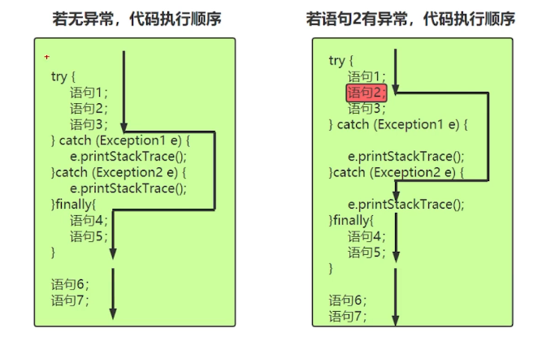

# 第二周学习笔记

## ##一、抽象类、接口

1. 抽象方法：用abstract修饰的方法，无方法体，只有声明；定义的是一种“规范”，即告诉子类必须具体实现抽象方法。

2. 抽象类：含抽象方法的类。通过抽象类可以限制子类的设计，使子类更加通用。

   ```java
   public abstract class Animal{
   	public abstract void run();
   }
   class Dog extends Animal{
   	public void run(){
   	System.out.println("yyyyyyy");
   	}
   }
   ```

   
   
3. 接口interface（是一种特殊的、比抽象类还抽象的类）   是一组规范，所有实现类都要遵守。定义接口时，访问修饰符只能是public或者默认；接口可以多继承；接口中主要是常量（public static final）和抽象方法（public abstract）。

   ```Java
   public interface interface1 {
       public static final int flyhigh = 100;
       public abstract void fly();
   }
   interface kind extends interface1{
       public abstract void helpothers();
   }
   class goodMan implements kind{
   
   
       @Override
       public void fly() {
           System.out.println("飞到高空100米上");
       }
   
       @Override
       public void helpothers() {
           System.out.println("乐于助人");
       }
   }
   ```

4. jdk8之后接口可以有默认方法（也叫扩展方法），**即用default关键字修饰的普通方法**，是一种替代方式，可实现可不实现。

   ```java
   interface kind extends interface1{
       public abstract void helpothers();
       default /*用default关键字修饰普通方法*/void testmoren(){
           System.out.println("mmmmmmmmmm");
       }
   }
   ```

5. jdk8之后接口可以直接定义静态方法，该方法属于接口，用接口名调用。

6. 接口的多继承：子接口extends父接口，会获得父接口的一切。

   ```java
   public class testmultipleinterface {
       public static void main(String[] args) {
           testmulinter test01 = new testmulinter();
           test01.testA();
           test01.testB();
           test01.testC();
       }
   }
   interface A{
       public abstract void testA();
   }
   interface B{
       void testB();
   }
   interface C extends A,B{
       void testC();
   }
   class testmulinter implements C{
   
       @Override
       public void testA() {
           System.out.println("AAAAAA");
       }
   
       @Override
       public void testB() {
           System.out.println("BBBBB");
       }
   
       @Override
       public void testC() {
           System.out.println("CCCCC");
       }
   }
   ```

## ##二、String类、内部类

1. string类位于java.lang包，Java字符串是Unicode字符串，用双引号括起来。

   ```java
   public class teststring {
       public static void main(String[] args){
           String s = null;//空指针，其对象为空
           String s1 = "";//已有对象，空字符串也是字符串,长度为0
           String s2 = "java";//长度为4
           String s3 = new String("jdkjre");
           System.out.println(s1.length());
           System.out.println(s2.length());
           System.out.println(s3.length());
   
       }
   }
   
   ```

2. 方法区的常量池有3种：全局字符串常量池、class文件常量池、运行时常量池（Runtime  Constant  Pool）。**每一个class都有自己的一个运行时常量池。**

   ```java
   public class teststring {
       public static void main(String[] args){
   
             String s1 = "China";
             String s2 = "China";//s1和s2是同一个对象,该对象在常量池上。
             String s3 = new String("China");//s3是新建的一个对象，该对象在堆上，与s1、s2是不同对象
             System.out.println(s1 == s2);//true
             System.out.println(s1 == s3);//判断是否为同一对象,false
             System.out.println(s1.equals(s3));//equals判断字符串是否相同,true
   
       }
   }
   ```

3. String类的常用方法：equals(),equalsIgnoreCase(),replace(),charAt(),indexOf(),lastIndexOf(),startsWith(),endsWith(),tolowerCase(),toUpperCase(),trim()。

   ```java
   public class teststring {
       public static void main(String[] args){
             String s = "";//已有对象，空字符串也是字符串,长度为0
             String s1 = "China";
             String s2 = "chin a";
           String s3 = new String("china");
           String s4 = s1.replace('n','N');
           String s5 = "  How are you?";
           
           System.out.println(s1.equals(s3));
           //equals判断字符串是否相同
           System.out.println(s1.charAt(4));
           //打印下标4的字符
           System.out.println(s1.equalsIgnoreCase(s3));
           //忽略大小写判断是否相同
           System.out.println(s1.indexOf("in"));
           //从前往后找，判断字符串是否有in，有则返回下标，没有则返回-1
           System.out.println(s1.indexOf('q'));
           System.out.println(s1.lastIndexOf("na"));
           //从后往前找，但下标仍从前开始数
           System.out.println(s5.startsWith("Ho"));
           //判断是否一Ho开头
           System.out.println(s5.endsWith("ou?"));
           //判断是否以ou?结尾
           s=s5.substring(3);//从下标3开始提取字符
           System.out.println(s);
           s=s5.substring(4,7);//下标[4,7)
           System.out.println(s);
           s=s5.toLowerCase();//转小写
           System.out.println(s);
           s=s5.toUpperCase();//转大写
           s=s5.trim();//去除字符串的首尾空格，因为String是不可变字符串，所以s5不变
           System.out.println(s);
           System.out.println(s5);
       }
   }
   
   ```

4. 内部类

5. 内部类的2个要点：

6. 非静态内部类

   ```java
   package com.chao.test.innerclass;
   
   public class Outer {
       private int age = 10;
       public void show(){
           System.out.println("Outer.Show");
           System.out.println(age);
       }
   
       //非静态类的内部类
       public class Inner{
           int age = 20;
           public void show(){
               System.out.println("Inner.show");
               System.out.println(age);
               System.out.println(Outer.this.age);
               Outer.this.show();
           }
   
       }
   }
   package com.chao.test.innerclass;
   
   public class testInner {
       public static void main(String[] args) {
           Outer.Inner i = new Outer().new Inner();
           Outer o  = new Outer();
           o.show();
           i.show();
           System.out.println(i.age);
       }
   }
   ```

7. 静态内部类

   ```java
   package com.chao.test.innerclass;
   
   public class staticInner {
       public static void main(String[] args) {
           //通过new 外部类名.内部类名() 来创建内部类对象
           Outer2.Inner2 inner = new Outer2.Inner2();
           inner.test();
       }
   }
   
   class Outer2{
       private int a = 1;
       private static int b= 2;
       //相当于外部类的静态属性
       static class Inner2{
           public void test(){
       // System.out.println(a);静态内部类不能访问外部类的普通属性
               System.out.println(b);//静态内部类可以访问外部类的静态属性
           }
       }
   }
   ```
   
8. 匿名内部类：适合只需要使用一次的类。

   ```java
   package com.chao.test.innerclass;
   
   public class testhidenameInner {
       public void test1(A a){
           a.run();
       }
   
       public static void main(String[] args) {
           testhidenameInner t = new testhidenameInner();
           
           t.test1(new A() {
               @Override
               public void run() {
                   System.out.println("建立匿名内部类来操作");
               }
           });
   
           t.test1(new Aint());
       }
   }
   
   interface A{
       void run();
   }
   class Aint implements A{
   
       @Override
       public void run() {
           System.out.println("建立一个实现类来操作");
       }
   }
   ```

9. 局部内部类：定义在方法内，作用域只限于本方法。

## ##三、数组

1. 数组的定义：数组是相同数据类型的有序集合。其中，每一个数据称为一个元素，每个元素可以通过一个索引（下标）来访问它们。

2. 数组的4个基本特点：

3. 数组声明方式：`type[] arr_name; 或者type arr_name[];`

4. 数组的定义：

   ```java
   package com.chao.test.array;
   
   public class testArray {
       public static void main(String[] args) {
           int[] s;
           s = new int[10];
           for(int i=0;i<10;i++){
               s[i]=2*i+1;
               System.out.print(s[i]+"\t");
           }
           System.out.println();
           Man[] mans = new Man[10];
           for(int i=0;i<10;i++){
               Man m = new Man(20+i,10000+i);
               mans[i] = m;
               System.out.print(mans[i].getAge()+"\t");
               System.out.println(mans[i].getId());
           }
       }
   }
   class Man{
       private int age;
       private int id;
       public Man(int age,int id){
           this.age = age;
           this.id = id;
       }
   
       public int getAge() {
           return age;
       }
   
       public void setAge(int age) {
           this.age = age;
       }
   
       public int getId() {
           return id;
       }
   
       public void setId(int id) {
           this.id = id;
       }
   }
   
   ```

5. 数组的3种初始化方式：静态初始化、动态初始化、默认初始化。

   ```java
   package com.chao.test.array;
   
   public class testarray2 {
       public static void main(String[] args) {
           //静态初始化
           int[] s = {1,2,3,4};
           Man[] mans = {new Man(10,100001),
                         new Man(20,100002),
                         new Man(25,100003)};
           System.out.println(mans[1].getId());
   
           //动态初始化
           Man[] mans2 = new Man[10];
           Man m1 = new Man(89,12233);
           mans2[0] = m1;
   
           //默认初始化，数组也是对象，会隐式赋值
           int[] n = new int[2];//默认为0
           boolean[] tf = new boolean[2];//默认值为false
           String[] strings = new String[2];//默认值为null
       }
   }
   
   ```

6. 数组的遍历：

   ```java
   package com.chao.test.array;
   
   public class testBianli {
       public static void main(String[] args) {
           String[] cities = {"北京","上海","广州","深圳"};
           //传统方式遍历
           for(int i=0;i<cities.length;i++){
               System.out.println(cities[i]);
           }
           //foreach遍历
           for(String temp:cities){
               System.out.println(temp);
           }
       }
   }
   ```

7. 数组的拷贝使用方法   System.arraycopy(object src,  int srcpos,  object dest,  int destpos,  int length )：

   ```java
   package com.chao.test.array;
   
   public class testBianli {
       public static void main(String[] args) {
           String[] cities = {"北京","上海","广州","深圳","成都","杭州"};
           String[] citiesBak = new String[9];
           System.arraycopy(cities,0,citiesBak,0,6);
           for (String t:citiesBak
                ) {
               System.out.print(t+"\t");
           }
       }
   }
   
   ```

8. java.util.Arrays工具类   包含了排序、查找、填充、打印等数组的常见操作。

   ```java
   package com.chao.test.array;
   
   import java.util.Arrays;
   
   public class test {
       public static void main(String[] args) {
           //使用Arrays工具类打印
           int[] a = {1,2};
           System.out.println(a);//打印数组引用的地址
           System.out.println(Arrays.toString(a));
           //打印数组元素的值
   
           //使用Arrays类做排序
           int[] a2 ={23,765,2,65,87,98};
           System.out.println(Arrays.toString(a2));
           Arrays.sort(a2);
           System.out.println(Arrays.toString(a2));
           //使用二分法查找必须先排序
          System.out.println(Arrays.binarySearch(a2,5));
           //返回排序后的索引位置，若未找到则返回负数
   
           //填充,从2到4，不包含4
           Arrays.fill(a2,2,4,100);
           System.out.println(Arrays.toString(a2));
       }
   }
   ```

9. 多维数组：可以看作以数组为元素的数组（数组里面套数组）。

   ```java
   package com.chao.test.array;
   //多维数组
   public class test {
       public static void main(String[] args) {
           int[][] a =new int[3][];
           a[0]=new int[2];
           a[1]=new int[4];
           a[2]=new int[3];
   
           int[][] b={{1,2,3},{5,6},{8,10}};
           int[][] c=new int[3][];
           //c[0] ={15,3,5} 是非法的
           c[0] =new int[]{15,3,5};
           c[1] =new int[]{4,5};
           c[2] =new int[]{2,4,5,6,5};
       }
   }
   
   ```

   ```java
   package com.chao.test.array;
   
   import java.util.Arrays;
   //将表格数据做成二维数组
   public class test {
       public static void main(String[] args) {
           Object[] a={1000,"China","2022/1/1"};
           Object[] b={1001,"America","2022/3/3"};
           Object[] c={1002,"Japan","2022/5/5"};
           Object[][] D=new Object[3][];
           D[0]=a;
           D[1]=b;
           D[2]=c;
           System.out.println(Arrays.toString(D[0]));
           System.out.println(Arrays.toString(D[1]));
           System.out.println(Arrays.toString(D[2]));
       }
   }
   ```

   ```java
   package com.chao.test.array;
   //使用JavaBean和数组保存表格内容
   public class test {
       public static void main(String[] args) {
           Emp[] emps = {
                   new Emp(1000,"zhao",26,"sheyingshi","2021/3"),
                   new Emp(1001,"wu",34,"boss","2020/9"),
                   new Emp(1002,"lin",27,"doctor","2022/1")
           };
           for(Emp e:emps){
               System.out.println(e);
           }
   
       }
   }
   class Emp{
       private int id;
       private String name;
       private int age;
       private String job;
       private String hiredate;
   
       @Override
       public String toString() {
           return "Emp{" +
                   "id=" + id +
                   ", name='" + name + '\'' +
                   ", age=" + age +
                   ", job='" + job + '\'' +
                   ", hiredate='" + hiredate + '\'' +
                   '}';
       }
   
       public Emp(int id, String name, int age, String job, String hiredate) {
           this.id = id;
           this.name = name;
           this.age = age;
           this.job = job;
           this.hiredate = hiredate;
       }
   
       public int getId() {
           return id;
       }
   
       public void setId(int id) {
           this.id = id;
       }
   
       public String getName() {
           return name; 
       }
   
       public void setName(String name) {
           this.name = name;
       }
   
       public int getAge() {
           return age;
       }
   
       public void setAge(int age) {
           this.age = age;
       }
   
       public String getJob() {
           return job;
       }
   
       public void setJob(String job) {
           this.job = job;
       }
   
       public String getHiredate() {
           return hiredate;
       }
   
       public void setHiredate(String hiredate) {
           this.hiredate = hiredate;
       }
   }
   ```

10. **Comparable接口**：多个对象作比较，需要比较规则，才能实现排序。Comparable接口只有一个方法   public  int  compareTo(Object  obj){  }

    ```java
    //要排序的类需要实现Comparable接口，根据其compareTo方法排序
     public int compareTo(Object o){
            Emp emp = (Emp)o;
            if(this.age>emp.age){
                return 1;
            }
            if(this.age<emp.age){
                return -1;
            }
            return 0;
        }
    
    ```

11. 数组的常见算法：冒泡排序和二分查找

    ```java
    package com.chao.test.array;
    
    import java.util.Arrays;
    
    public class testBubbleSort {
        public static void main(String[] args) {
            int[] values = {3,5,2,4,87,23,98,23,6};
            System.out.println("初始顺序"+ Arrays.toString(values));
            bubbleSort2(values);
            int searchword = 2354;
            System.out.println(searchword+"的索引："+binarySearch(values,searchword));
        }
        public static void bubbleSort(int[] values){
            int temp;
            for(int i=0;i<values.length-1;i++){
                for(int j=0;j<values.length-1-i;j++){
                    if(values[j]>values[j+1]){
                        temp=values[j];
                        values[j]=values[j+1];
                        values[j+1]=temp;
                    }
                }
                System.out.println((i+1)+"趟排序"+Arrays.toString(values));
            }
        }
        //优化后的算法
        public static void bubbleSort2(int[] values){
            int temp;
            for(int i=0;i<values.length-1;i++){
                boolean flag = true;//标记变量
                for(int j=0;j<values.length-1-i;j++){
                    if(values[j]>values[j+1]){
                        temp=values[j];
                        values[j]=values[j+1];
                        values[j+1]=temp;
                        flag = false;
                    }
                }
                if(flag) break;
                System.out.println((i+1)+"趟排序"+Arrays.toString(values));
            }
        }
        
        //二分法查找
        public static int binarySearch(int[] values,int searchword){
            int low = 0;
            int high = values.length-1;
            while(low<=high){
                int middle=(low+high)/2;
                if(searchword==values[middle]){
                    return middle;
                }
                if(searchword>values[middle]){
                    low =middle+1;
                }
                if(searchword<values[middle]){
                    high =middle-1;
                }
            }
            return -1;
        }
    
    }
    ```

## ##四、常用类

1. 包装类（Wrapper  Class）位于java.lang包，为了方便将基本数据类型转化成对象，每一个基本数据类型都有对应的一个类进行代表：Integer、Character、Byte、Long、Boolean、Float、Double、Short。其中6个数字型包装类都是Number类（抽象类）的子类，可以互相转型。

   ```java
   package com.chao.test.changyonlei;
   
   public class testInteger {
       public static void main(String[] args){
           Integer i = new Integer(50);//从Java9开始废弃
           Integer j =Integer.valueOf(50);//官方推荐
   
           int a = j.intValue();
           double b =j.doubleValue();//把包装类对象转成基本数据类型
   
           //把字符串转成数字
           Integer m =Integer.valueOf("6789");
           System.out.println(m);
       }
   }
   ```

2. 自动装箱（autoboxing）和拆箱（unboxing）：将基本数据类型和包装类自动转换。

   ```java
   package com.chao.test.changyonlei;
   
   public class testAutoboxing$Unboxing {
       public static void main(String[] args) {
           Integer i=100;//编译器：Integer i=Integer.valueOf(100);
           int j=i;//编译器：int j=i.intValue();
   
           Integer x=null;
           //int y=x;编译器：int y=x.intValue();
   
           //自动装箱时，在[-128,127]的数有缓存!
           Integer x1=100;
           Integer x2=100;
           Integer x3=1000;
           Integer x4=1000;
           System.out.println(x1==x2);//true,是同一个对象
           System.out.println(x3==x4);//false，是2个不同对象
           System.out.println(x1.equals(x2));//true，重写equals，比较的对象的值
           System.out.println(x3.equals(x4));//true
   
       }
   }
   ```

3. StringBuffer和StringBuilder可变字符序列：StringBuffer线程安全，效率低；StringBuilder 线程不安全，效率高（常用此类）。

   ```java
   package com.chao.test.changyonlei;
   
   public class testString {
       public static void main(String[] args) {
           StringBuilder sb =new StringBuilder();
           for(int i=0;i<7;i++){
               sb.append((char)('a'+i));//追加单个字符
           }
           sb.append("love").append('Q').append("Africa");//方法链
           System.out.println(sb.toString());//转换成String输出
           sb.append("I love you !");
           System.out.println(sb.toString());
           
           //以下方法同样适用于StringBuilder
           StringBuffer sb2 = new StringBuffer("China中国");
           sb2.insert(0,"爱").insert(0,"我");
           System.out.println(sb2.toString());
           sb2.delete(0,2);//删除子字符串
           System.out.println(sb2);
           sb2.deleteCharAt(0).deleteCharAt(0);//删除某个字符
           System.out.println(sb2.charAt(0));//获取某个字符
           System.out.println(sb2.reverse());//字符串逆序
       }
   }
   ```

   **字符串拼接时，使用StringBuilder，不要用String**

   ```java
   package com.chao.test.changyonlei;
   
   public class StringDrawback {
       public static void main(String[] args) {
           String str1 ="";
           long num1 = Runtime.getRuntime().freeMemory();
           //获取当前系统剩余内存空间
           long time1=System.currentTimeMillis();
           //获取当前系统时间
           for(int i=0;i<5000;i++){
               str1 =str1+i;
           }
           System.out.println(str1);
           long num2=Runtime.getRuntime().freeMemory();
           long time2=System.currentTimeMillis();
           System.out.println("String占用内存"+(num2-num1));
           System.out.println("String占用时间"+(time2-time1));
   
           StringBuilder str2=new StringBuilder("");
           long num3=Runtime.getRuntime().freeMemory();
           long time3=System.currentTimeMillis();
           for(int i=0;i<5000;i++){
               str2.append(i);
           }
           long num4=Runtime.getRuntime().freeMemory();
           long time4=System.currentTimeMillis();
           System.out.println(str2);
           System.out.println("StringBuilder占用内存"+(num4-num3));
           System.out.println("StringBuilder占用时间"+(time4-time3));
   
       }
   }
   ```

4. 时间处理相关类Date类（java.util.Date）

   ```java
   package com.chao.test.changyonlei;
   
   import java.util.Date;
   //在计算机世界里，以1970年1月1日00:00:00为 基准时间，度量单位为毫秒（千分之一秒）
   public class testDate {
       public static void main(String[] args) {
           long nownum = System.currentTimeMillis();
           System.out.println(nownum);
           Date date1 = new Date(-987654321234L);
           System.out.println(date1);//输出成  何年何月何日几时几分几秒
           System.out.println(date1.getTime());//输出-987654321234
           Date date2 = new Date(-456789034567L);
           System.out.println(date2);
           System.out.println(date1.equals(date2));
           System.out.println(date1.before(date2));
           System.out.println(date2.after(date1));
       }
   }
   ```

5. DateFormat类和SimpleDateFormat类（用于字符串和时间的转换），DateFormat类是抽象类，常用其子类SimpleDateFormat类。

   ```java
   package com.chao.test.changyonlei;
   
   import java.text.ParseException;
   import java.text.SimpleDateFormat;
   import java.text.DateFormat;
   import java.util.Date;
   
   public class testDateFormat {
       public static void main(String[] args) throws ParseException {
           DateFormat format = new SimpleDateFormat("yyyy-MM-dd hh:mm:ss");//特殊字符不可变，其他可变。
           String str = "2049-10-01 10:10:10";
           Date guoqing100 = format.parse(str);
           System.out.println(guoqing100.getTime());
           System.out.println(guoqing100);
   
           DateFormat format2 = new SimpleDateFormat("yyyy年MM月dd日 hh:mm:ss");
           Date date2 = new Date(345678905678L);
           String strdate2 =format2.format(date2);
           System.out.println(strdate2);
       }
   }
   ```

6. Calendar日历类是抽象类，GregorianCalendar类是Calendar类的子类，表示公历。

7. Math类和Random类

   ```java
   package com.chao.test.changyonlei;
   //java.lang.Math
   public class testMath {
       public static void main(String[] args) {
           //取整相关操作
           System.out.println(Math.ceil(3.2));
           System.out.println(Math.floor(3.2));
           System.out.println(Math.round(3.2));
           System.out.println(Math.round(2.8));
           //绝对值、开方、幂的操作
           System.out.println(Math.abs(-78));
           System.out.println(Math.sqrt(64));
           System.out.println(Math.pow(5,2));
           System.out.println(Math.pow(2,5));
           //Math类中常用的常量
           System.out.println(Math.PI);
           System.out.println(Math.E);
           //随机数
           System.out.println(Math.random());//获取[0,1)的double数
       }
   }
   ```

   ```java
   package com.chao.test.changyonlei;
   
   import java.util.Random;
   
   public class testRandom {
       public static void main(String[] args) {
           Random rand = new Random();
   
           //随机生成[0,1)的double类型数据
           System.out.println(rand.nextDouble());
           //随机生成int类型范围允许之内的整型数据
           System.out.println(rand.nextInt());
           //随机生成[0,1)之间的float类型数据
           System.out.println(rand.nextFloat());
           //随机生成false或true
           System.out.println(rand.nextBoolean());
           //随机生成[0,10)的int类型数据
           System.out.println(rand.nextInt(10));
           //随机生成[20,30)的int类型数据
           System.out.println(20+rand.nextInt(10));
           //随机生成[20,30)的int类型数据,此方法较复杂
           System.out.print(20+(int)(rand.nextDouble()*10));
       }
   }
   ```

8. File类     java.io.File类用来代表文件和目录，用于：读取文件、创建文件、删除文件、修改文件。**File类的常见构造方法：public  File(String pathname)，以pathname为路径创建File对象，如果pathname是相对路径，则默认的当前路径在系统属性user.dir中存储。**

   ```java
   package com.chao.test.changyonlei;
   
   import java.io.File;
   import java.io.IOException;
   import java.util.Date;
   
   public class testFile1 {
       public static void main(String[] args) throws IOException {
           System.out.println(System.getProperty("user.dir"));
           File f = new File("a.txt");//相对路径，默认放在user.dir目录下面
           f.createNewFile();//创建文件
           File f2 = new File("d:/b.txt");//绝对路径
           f2.createNewFile();
           f2.delete();//删除文件
           
           System.out.println("File是否存在："+f.exists());
           System.out.println("File是否是目录："+f.isDirectory());
           System.out.println("File是否是文件："+f.isFile());
           System.out.println("File最后修改时间："+new Date(f.lastModified()));
           System.out.println("File的大小："+f.length());
           System.out.println("File的文件名："+f.getName());
           System.out.println("File的相对路径："+f.getPath());
           System.out.println("File的绝对路径："+f.getAbsolutePath());
   
           File f3 =new File("d:/电影/华语/大陆");
           boolean flag = f3.mkdir();//目录结构中有一个不存在，则不会创建整个目录树
           System.out.println(flag);//创建失败
           boolean flag2 =f3.mkdirs();//目录结构中有一个不存在也没关系，会创建整个目录树
           System.out.println(flag2);//创建成功
   
       }
   }
   ```

   ```java
   //File类_递归_打印目录树结构
   
   package com.chao.test.changyonlei;
   
   import java.io.File;
   
   public class printFileTree {
       public static void main(String[] args) {
           File f =new File("D:\\Wwenjian\\1java\\myproject1");
           printFile(f,0);
       }
       static void printFile(File file,int level){
           for(int i=0;i<level;i++){
               System.out.print('-');
           }
           //输出文件名
           System.out.println(file.getName());
           if(file.isDirectory()){
               File[] files = file.listFiles();//列出他的所有子文件、子目录，即下一层
               for(File temp:files){
                   printFile(temp,level+1);
               }
           }
       }
   }
   ```

   

9. 枚举类型enum，枚举类型的定义包括枚举声明和枚举体。所有枚举类型实质上还是类，都隐性继承自java.lang.Enum。每个被枚举的成员实质就是一个枚举类型的实例，默认都是public static final 修饰的，可以直接通过枚举类型名使用它们。

   ```
   enum 枚举名{
   	枚举体（常量列表）
   }
   ```

   很多时候枚举类型可以用普通类代替

   ```java
   package com.chao.test.changyonlei;
   
   import java.util.Random;
   
   public class testEnum {
       public static void main(String[] args) {
           System.out.println(Season.SPRING);
           System.out.println(sseason.SPRING);
           
           for(sseason s:sseason.values()){
               System.out.println(s);
           }
   
           int a = new Random().nextInt(4);
           switch(sseason.values()[a]){
               case SPRING:
                   System.out.println("春天");
                   break;
               case SUMMER:
                   System.out.println("夏天");
                   break;
               case AUTUMN:
                   System.out.println("秋天");
                   break;
               case WINTER:
                   System.out.println("冬天");
                   break;
           }
       }
   }
   
   enum sseason{
       SPRING,SUMMER,AUTUMN,WINTER
   }
   class Season{
       public static final int SPRING = 0;
       public static final int SUMMER = 1;
       public static final int AUTUMN = 2;
       public static final int WINTER = 3;
   }
   ```

   

## ##五、异常机制

1. 异常（Exception）的概念：异常指程序运行过程中出现的非正常现象，例如数组越界、文件不存在等；在Java的  异常处理机制中，**引进了很多用来描述和处理异常的类，称为异常类**。异常类定义中包含了**该类异常的信息和对异常进行处理的方法。**      java对异常进行分类，不同类型的异常分别用不同的Java类表示，所有异常的根类为java.lang.Throwable，**Throwable又派生了两个子类：Error和Exception。**

2. 异常机制的本质：当程序出现异常，程序安全的退出、处理完后继续执行的机制。

3. Error是程序无法处理的问题，表示代码运行时JVM出现的问题（即系统JVM已经处于不可恢复的崩溃状态中，需重启）。

4. Exception是程序本身能够解决的异常。通常Java的异常可分为：RuntimeException（运行时异常，即运行时才知道的错误）和  CheckedException（已检查异常，即编译时就报错）。

5. 异常的处理方式之一：捕获异常。

   ​        try语句块指定了一段可能为异常的代码，**当任意一句语句产生异常时，就会跳过它后面的代码**，一个try语句块必须带有至少一个catch语句块或一个finall语句块。    **catch捕获异常时，如果异常类之间有继承关系，先捕获子类异常再捕获父类异常。**       **不管是否发生异常，finally语句块都会执行。**

   ```java
   package com.chao.test.Exception;
   
   import java.io.FileNotFoundException;
   import java.io.FileReader;
   import java.io.IOException;
   
   public class testCheckedException {
       public static void main(String[] ) {
           FileReader reader = null;
           try {
               reader = new FileReader("d:/a.txt");
               char c = (char)reader.read();
               char c2 =(char)reader.read();
               System.out.println(""+c+c2);
           } catch (FileNotFoundException e) {
               e.printStackTrace();
           } catch (IOException e) {
               e.printStackTrace();
           }finally{
               try {
                   if(reader!=null) {
                       reader.close();
                   }
               } catch (IOException e) {
                   e.printStackTrace();
               }
           }
       }
   }
   ```

6. 异常的处理方式之二：声明异常（throws）

   ```java
   package com.chao.test.Exception;
   
   import java.io.FileReader;
   import java.io.IOException;
   
   public class testCheckedException2 {
       public static void main(String[] args) throws IOException {
           FileReader reader = null;
           try {
               reader = new FileReader("d:/a.txt");
               char c = (char)reader.read();
               char c2 =(char)reader.read();
               System.out.println(""+c+c2);
           } finally{
               try {
                   if(reader!=null) {
                       reader.close(); 
                   }
               } catch (IOException e) {
                   e.printStackTrace();
               }
           }
   
       }
   }
   ```

7. try-with-resource 语法可以自动关闭实现了Closable接口的资源（类）。实现类需要实现close()方法。"try-with-resource声明"，将try-with-finally  简化为try-catch，在编译时仍然会进行转化为try-catch-finally语句（实际上并无变化，只是方便了程序员）。

   ```java
   package com.chao.test.Exception;
   
   import java.io.FileReader;
   
   public class testTryWithResource {
       public static void main(String[] args) {
   
           try( FileReader reader = new FileReader("d:/a.txt");){
               char c = (char)reader.read();
               char c2 =(char)reader.read();
               System.out.println(""+c+c2);
           }catch(Exception e){
               e.printStackTrace();
           }
           
       }
   }
   ```

8. 自定义异常：即创建自己的异常类。一般自定义异常类应该包含2个构造器，一个是默认的构造器，一个是带有详细信息的构造器。  **自定义异常类只需从Exception类或者它的子类派生一个子类即可，一般继承Exception类或者RuntimeException类。**

   ```java
   package com.chao.test.MyException;
   /**
    * 非法年龄异常类   */
   public class IllegalAgeException extends Exception {
       //默认构造器
       public IllegalAgeException(){
       }
       //带有详细信息的构造器，信息存储在message中
       public IllegalAgeException(String message){
           super(message);
       }
   }
   ```

   ```java
   package com.chao.test.MyException;
   
   public class testMyException {
       public static void main(String[] args) throws IllegalAgeException {
           Person p = new Person();
           p.setName("jinchao");
           try{
               p.setAge(-78);
           }catch(IllegalAgeException e){
               e.printStackTrace();
           }
   
           System.out.println(p);
       }
   }
   
   class Person{
       private String name;
       private int age=10000;
   
       public void setName(String name) {
           this.name = name;
       }
       public void setAge(int age) throws IllegalAgeException{
           if(age<0){
               throw new IllegalAgeException("人的年龄不应该为负数");
           }
           this.age = age;
       }
       public String toString(){
           return "name is "+name+"  "+"and age is "+age;
       }
   }
   ```

   

## ##六、泛型（Generics）

1. **泛型的本质是“数据类型的参数化”**，可以把泛型理解为数据类型的一个占位符，即告诉编译器在调用泛型时必须传入实际类型，这种参数类型可以在类、接口和方法中，分别被称为泛型类、泛型接口、泛型方法。**即把数据类型（只能是引用类型）当作参数一样传递。**

2. 定义泛型

   ```java
   package com.chao.test.Generies;
   //泛型类
   public class testGeneric1 {
       public static void main(String[] args) {
           Generic<String> generic = new Generic<>();
           generic.setFlag("abc");
           String flag = generic.getFlag();
           System.out.println(flag);
   
           Generic<Integer> generic1 = new Generic<>();
           generic1.setFlag(100);
           Integer flag1 = generic1.getFlag();
           System.out.println(flag1);
       }
   }
   
    class Generic <T> {
       private T flag;
       public void setFlag(T flag){
           this.flag = flag;
       }
       public T getFlag(){
           return this.flag;
       }
   }
   ```
   
   ```java
   package com.chao.test.Generies;
   //泛型接口
   public interface InterfaceGeneric <T>{
       T getName(T name);
   }
   
   
   public class IgenericImg implements InterfaceGeneric<String>{
       @Override
       public String getName(String name) {
           return name;
       }
   }
   class test {
       public static void main(String[] args) {
           IgenericImg test1 = new IgenericImg();
           String name1 = test1.getName("tyui");
           System.out.println(name1);
   
           InterfaceGeneric <String> test2 =new IgenericImg();
           String name2 = test2.getName("werer");
           System.out.println(name2);
       }
   }
   ```
   
   ```java
   package com.chao.test.Generies;
   //泛型非静态方法
   public class MethodGeneric {
       public <T> void setName(T name){
           System.out.println(name);
       }
       public <T> T getName(T name){
           return name;
       }
   }
   class testMG {
       public static void main(String[] args) {
           MethodGeneric test1 =new MethodGeneric();
           test1.setName("jinchao");
   
           MethodGeneric test2=new MethodGeneric();
           String name = test2.getName("JINCHAO");
           Integer name1 =test2.getName(456789);
           System.out.println(name);
           System.out.println(name1);
       }
   }
   ```
   
   ```java
   //静态方法无法访问类上定义的泛型，如果静态方法操作的引用类型不确定时，必须将泛型定义在方法上。-----泛型静态方法
   package com.chao.test.Generies;
   
   public class MethodGeneric {
   
       public static <T> void getFlag(T flag){
           System.out.println(flag);
       }
       public static <T> T setFlag(T flag){
           return flag;
       }
   }
   
   class testMG {
       public static void main(String[] args) {
           MethodGeneric test2=new MethodGeneric();
           String flag =test2.setFlag("wertyui");
           System.out.println(flag);
           test2.getFlag(67890);
       }
   }
   
   ```
   
   ```java
   package com.chao.test.Generies;
   //泛型方法与可变参数（数组）
   public class MethodGeneric {
       public <T> void outarr(T...arr){
           for(T t:arr){
               System.out.println(t);
           }
       }
   }
   
   class testMG {
       public static void main(String[] args) {
     	    MethodGeneric test2=new MethodGeneric();
           String[] arr1 =new String[]{"q","ew3","rew"};
           test2.outarr(arr1);
           Integer[] arr2=new Integer[]{123,56,678};
           test2.outarr(arr2);
       }
   }
   ```
   
3. 无界通配符：？表示类型通配符，用于代替具体的类型。它只能在<>中使用。可以解决具体类型不确定的问题。

   ```java
   public void show(Generic<?> generic){
   }
   ```

4. 通配符的上限限定：上限限定表示通配符的类型是T类以及T类的子类或T接口以及T接口的子接口。**该方式同样适用于与泛型类的上限限定。**

   ```java
   public void show(Generic <? extends Number> generic){
   }
   
   public class Show<T extends Number>{
   }
   ```

5. 通配符的下限限定：下限限定表示通配符的类型是T类以及T类的父类或者T接口以及T接口的父接口。**该方式不适用于泛型类。**

   ```java
   public void show(Generic <? super Integer> generic){
   }
   ```

   

## 


